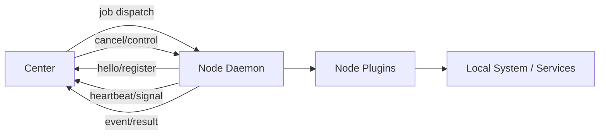
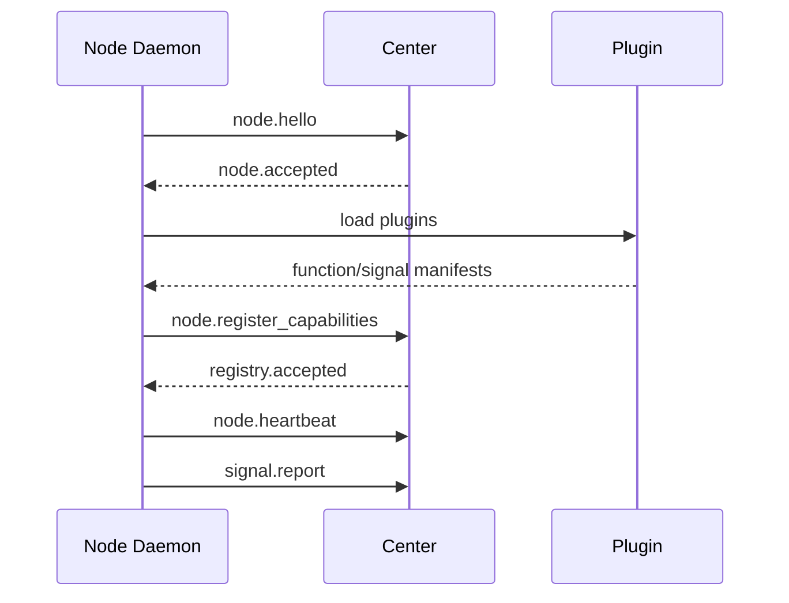
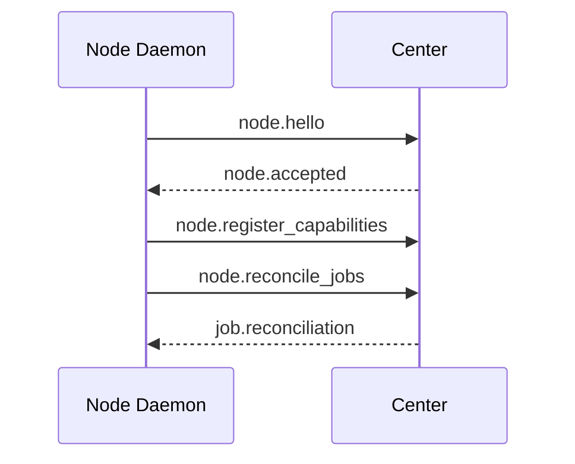

# YeQu Protocol (YQP)

版本：v0.1  
状态：Node 对接协议草案  
目标读者：Node Daemon、Windows Node、远端设备、未来 OOB Node 的开发者  

## 1. 协议目标

YeQu Protocol，简称 YQP，是 Center 与 Node Daemon 之间的对接协议。它用于统一 Node 身份注册、心跳、能力注册、Signal 上报、Job 执行、事件回传、取消与重连恢复。

YQP 不定义具体业务服务行为。Node 侧通过 Plugin 暴露 Function 和 Signal，Center 只按协议处理调用和状态。

## 2. 通信模型



### 2.1 传输方式

| 通道 | 用途 | 要求 |
|---|---|---|
| HTTPS REST | 注册、拉取任务、上报 Signal、提交结果 | 必须支持 |
| WebSocket | 实时 Job 下发、事件流、低延迟心跳 | 推荐支持 |
| SSE | Client 侧订阅事件 | Node 侧可不实现 |

第一版 Node 可以只实现 HTTPS REST。WebSocket 作为后续优化，不改变消息语义。

### 2.2 认证通道

Node 身份凭据不放入 YQP payload。所有 Node -> Center 请求必须通过传输层认证通道携带凭据：

```http
Authorization: Bearer <node_token>
```

Center 必须先完成 token 校验，再处理 `node.hello`、能力注册、心跳、Signal、Job 结果或续租消息。`node_id` 必须与 token 绑定关系一致，否则返回 `auth_failed`。

首次接入的新 Node 不允许仅凭 `node.hello` 自动加入系统。Center 应先通过管理面完成 Node 预配，生成 `node_id` 和 `node_token`。未预配 Node 的 hello 请求只能进入待审批或拒绝流程，不得获得执行能力。

## 3. 消息 Envelope

所有 YQP 消息使用统一 Envelope。

```json
{
  "yqp_version": "0.1",
  "message_id": "msg_01H...",
  "message_type": "node.heartbeat",
  "trace_id": "tr_01H...",
  "node_id": "debian-home",
  "session_id": null,
  "timestamp": "2026-06-19T12:00:00Z",
  "payload": {}
}
```

| 字段 | 必填 | 说明 |
|---|---:|---|
| `yqp_version` | 是 | 协议版本。 |
| `message_id` | 是 | 消息唯一标识，用于去重和审计。 |
| `message_type` | 是 | 消息类型。 |
| `trace_id` | 是 | 链路追踪 ID。 |
| `node_id` | 视情况 | Node 相关消息必须提供。 |
| `session_id` | 否 | 与用户/Agent 会话相关时提供。 |
| `timestamp` | 是 | 消息生成时间。 |
| `payload` | 是 | 业务载荷。 |

## 4. Node 启动流程



## 5. Node Hello

Daemon 启动后先发送 `node.hello`。

```json
{
  "message_type": "node.hello",
  "node_id": "debian-home",
  "payload": {
    "daemon_version": "0.1.0",
    "node_name": "Debian Home",
    "role": ["center-host", "compute"],
    "locality": "local",
    "platform": {
      "os": "linux",
      "arch": "x86_64"
    }
  }
}
```

Center 响应：

```json
{
  "message_type": "node.accepted",
  "payload": {
    "heartbeat_interval_sec": 10,
    "heartbeat_timeout_multiplier": 3,
    "signal_report_interval_sec": 5,
    "signal_stale_multiplier": 3,
    "job_delivery_mode": "poll",
    "job_poll_interval_sec": 3,
    "server_time": "2026-06-19T12:00:00Z"
  }
}
```

| 字段 | 说明 |
|---|---|
| `heartbeat_interval_sec` | Daemon 发送心跳的目标间隔。 |
| `heartbeat_timeout_multiplier` | Center 判定心跳超时的倍数，默认建议为 `3`。 |
| `signal_report_interval_sec` | Daemon 聚合并上报 Signal 的目标间隔。 |
| `signal_stale_multiplier` | Center 判断 Signal 上报整体异常的倍数，默认建议为 `3`。 |
| `job_delivery_mode` | Job 投递模式，取值为 `poll` 或 `websocket_push`。 |
| `job_poll_interval_sec` | `poll` 模式下 Daemon 拉取 Job 的间隔；非 poll 模式下可为 `null`。 |
| `server_time` | Center 当前时间，用于 Daemon 观测时钟偏差。 |

## 6. Capability Registration

Node 加载 Plugin 后上报 Function 和 Signal manifest。

```json
{
  "message_type": "node.register_capabilities",
  "node_id": "debian-home",
  "payload": {
    "plugins": [
      {
        "plugin_id": "system.metrics",
        "plugin_version": "0.1.0",
        "functions": [
          {
            "name": "system.metrics.snapshot",
            "input_schema": {
              "type": "object",
              "properties": {}
            },
            "output_schema": {
              "type": "object",
              "properties": {
                "cpu": { "type": "number" },
                "memory": { "type": "number" },
                "disk": { "type": "number" }
              }
            },
            "risk": "safe",
            "effect": "read",
            "timeout_sec": 5,
            "idempotency": "idempotent"
          }
        ],
        "signals": [
          {
            "name": "system.cpu.usage",
            "scope": "node",
            "ttl_sec": 15,
            "value_schema": {
              "type": "number",
              "minimum": 0,
              "maximum": 100
            }
          }
        ]
      }
    ]
  }
}
```

### 6.1 Function Manifest

| 字段 | 说明 |
|---|---|
| `name` | 全局函数名。 |
| `input_schema` | JSON Schema 输入定义。 |
| `output_schema` | JSON Schema 输出定义。 |
| `risk` | `safe`, `maintenance`, `destructive`, `catastrophic`。 |
| `effect` | `read`, `write`, `destructive`, `external`。 |
| `timeout_sec` | 默认超时。 |
| `idempotency` | `idempotent`, `non_idempotent`, `transactional`。 |
| `resource_keys` | 可选。Function 会读写的资源键，用于冲突控制和审计。 |
| `conflict_policy` | 可选。资源冲突策略，如 `allow_parallel`, `serialize`, `reject_if_running`。 |

### 6.2 Signal Manifest

| 字段 | 说明 |
|---|---|
| `name` | Signal 名称。 |
| `scope` | `node`, `plugin`, `resource`。 |
| `ttl_sec` | Center 判断 freshness 的时间窗口。 |
| `value_schema` | Signal value 的 JSON Schema。 |

`value_schema` 必须使用 JSON Schema 表达类型和取值约束。Center 收到 Signal 后必须按 schema 校验，校验失败的值不得写入 State Store，但应写入审计事件并返回或记录 `schema_invalid`。

`ttl_sec` 应大于 `signal_report_interval_sec`。建议满足：

```text
ttl_sec >= signal_report_interval_sec * 3
```

不满足该约束的 Signal 可以被 Center 拒绝注册，或标记为配置风险。

### 6.3 注册语义

`node.register_capabilities` 表示当前 Node 的能力全量快照，可以在启动、重连、插件安装、插件卸载或插件升级后重复发送。Center 收到新的全量快照后，以 `(node_id, plugin_id, plugin_version)` 和 manifest 内容更新 Registry。

如果某个 Plugin 加载失败，Daemon 仍应上报其他已加载 Plugin，并在 `plugins` 中保留失败项：

```json
{
  "plugin_id": "system.service",
  "plugin_version": "0.1.0",
  "status": "error",
  "error": {
    "code": "plugin_load_failed",
    "message": "failed to initialize plugin"
  },
  "functions": [],
  "signals": []
}
```

成功加载的 Plugin 可省略 `status`，等价于 `loaded`。Center 不应因为单个 Plugin 加载失败拒绝整台 Node 的能力注册，除非失败项影响 Center 要求的必需能力。

## 7. Heartbeat

Daemon 按 Center 指定间隔发送心跳。

```json
{
  "message_type": "node.heartbeat",
  "node_id": "debian-home",
  "payload": {
    "daemon_uptime_sec": 3600,
    "running_jobs": 2,
    "plugin_count": 3,
    "status": "online"
  }
}
```

Center 根据 `heartbeat_interval_sec * heartbeat_timeout_multiplier` 判定心跳超时。默认配置下，10s 心跳间隔和 3 倍 multiplier 表示 30s 未收到有效心跳即进入 `offline`。

`running_jobs` 和 `plugin_count` 仅用于观测，不作为 Job 或 Registry 的事实来源。Center 发现心跳计数与自身状态不一致时，应触发 Job reconcile 或能力全量重报，而不是直接按计数修正状态。

## 8. Signal Report

Signal 用于持续状态上报。

```json
{
  "message_type": "signal.report",
  "node_id": "debian-home",
  "payload": {
    "signals": [
      {
        "name": "system.cpu.usage",
        "scope": "node",
        "value": 18.5,
        "collected_at": "2026-06-19T12:00:00Z",
        "ttl_sec": 15
      },
      {
        "name": "system.memory.usage",
        "scope": "node",
        "value": 62.3,
        "collected_at": "2026-06-19T12:00:00Z",
        "ttl_sec": 15
      }
    ]
  }
}
```

Center 收到 Signal 后按 `value_schema` 校验 `value`，按 `collected_at + ttl_sec` 判断 freshness。单个 Signal 过期时，该 Signal 进入 `stale`；心跳仍正常但关键 Signal stale 或 Plugin 部分失败时，Node 可进入 `degraded`。

## 9. Job Delivery

Job 支持 `poll` 和 `websocket_push` 两种投递模式。具体模式由 `node.accepted.payload.job_delivery_mode` 指定。

### 9.1 Poll 模式

`poll` 模式下，Daemon 按 `job_poll_interval_sec` 主动拉取待执行 Job。没有 Job 时 Center 返回空响应。

```json
{
  "message_type": "job.poll",
  "node_id": "debian-home",
  "payload": {
    "capacity": 1,
    "running_jobs": ["job_01H..."]
  }
}
```

有待执行 Job 时，Center 返回 `job.available`：

```json
{
  "message_type": "job.available",
  "node_id": "debian-home",
  "payload": {
    "jobs": [
      {
        "job_id": "job_01H...",
        "invocation_id": "inv_01H...",
        "function": "system.metrics.snapshot",
        "input": {},
        "timeout_sec": 5,
        "lease_sec": 10
      }
    ]
  }
}
```

没有待执行 Job 时，Center 返回 `job.empty` 或 HTTP 204。

### 9.2 WebSocket Push 模式

`websocket_push` 模式下，Center 通过 WebSocket 向 Daemon 发送 `job.dispatch`。

```json
{
  "message_type": "job.dispatch",
  "node_id": "debian-home",
  "payload": {
    "job_id": "job_01H...",
    "invocation_id": "inv_01H...",
    "function": "system.metrics.snapshot",
    "input": {},
    "timeout_sec": 5,
    "lease_sec": 10
  }
}
```

无论来自 `job.available` 还是 `job.dispatch`，Daemon 开始执行前都必须返回：

```json
{
  "message_type": "job.accepted",
  "node_id": "debian-home",
  "payload": {
    "job_id": "job_01H...",
    "accepted_at": "2026-06-19T12:00:01Z"
  }
}
```

如果 Daemon 无法接受 Job，应返回 `error`，错误码使用 `function_not_available`、`schema_invalid`、`lease_expired` 或 `internal_error`。

## 10. Job Events

Job 执行过程中，Daemon 上报事件。

```json
{
  "message_type": "job.event",
  "node_id": "debian-home",
  "payload": {
    "job_id": "job_01H...",
    "event_type": "job.progress",
    "sequence": 1,
    "data": {
      "message": "collecting metrics"
    }
  }
}
```

### 10.1 标准 Job Event 类型

| 类型 | 说明 |
|---|---|
| `job.started` | Job 开始执行。 |
| `job.progress` | 进度事件。 |
| `job.log` | 文本日志片段。 |
| `job.result` | 结果事件。 |
| `job.failed` | 失败事件。 |
| `job.cancelling` | 已收到取消请求，正在停止。 |
| `job.cancelled` | 取消事件。 |
| `job.timeout` | 超时事件。 |

## 11. Job Result

Job 完成后，Daemon 上报终态。

```json
{
  "message_type": "job.finished",
  "node_id": "debian-home",
  "payload": {
    "job_id": "job_01H...",
    "status": "succeeded",
    "output": {
      "cpu": 18.5,
      "memory": 62.3,
      "disk": 71.0
    },
    "finished_at": "2026-06-19T12:00:02Z"
  }
}
```

终态只能是：

| 状态 | 说明 |
|---|---|
| `succeeded` | 成功。 |
| `failed` | 执行失败。 |
| `cancelled` | 被取消。 |
| `timeout` | 超时。 |

## 12. Lease Renewal

长任务需要续租。

```json
{
  "message_type": "job.lease_renew",
  "node_id": "debian-home",
  "payload": {
    "job_id": "job_01H...",
    "lease_extend_sec": 10
  }
}
```

Center 可拒绝续租：

```json
{
  "message_type": "job.lease_denied",
  "payload": {
    "job_id": "job_01H...",
    "reason": "cancel_requested"
  }
}
```

Center 接受续租时返回：

```json
{
  "message_type": "job.lease_accepted",
  "payload": {
    "job_id": "job_01H...",
    "lease_expires_at": "2026-06-19T12:00:20Z"
  }
}
```

Daemon 应在 lease 剩余 50% 到 20% 的窗口内发起续租，避免在最后一刻续租导致网络抖动下误超时。Center 收到过期后的续租请求时可以返回 `job.lease_denied`，`reason` 为 `lease_expired`。

收到 `job.lease_denied` 后，Daemon 不得继续按正常成功路径提交结果。若本地任务仍在运行，应停止任务并上报 `job.finished`，终态使用 `cancelled`、`timeout` 或 `failed`，具体由 denied reason 决定。

## 13. Job Cancel

Center 可请求取消 Job。

```json
{
  "message_type": "job.cancel",
  "node_id": "debian-home",
  "payload": {
    "job_id": "job_01H...",
    "reason": "user_requested"
  }
}
```

Daemon 收到后应尽快返回可观测状态：

```json
{
  "message_type": "job.event",
  "node_id": "debian-home",
  "payload": {
    "job_id": "job_01H...",
    "event_type": "job.cancelling",
    "sequence": 2,
    "data": {
      "reason": "user_requested"
    }
  }
}
```

Daemon 完成停止后必须上报 `job.finished(status="cancelled")`。如果 Center 发出取消后在 `lease_sec` 或 Job timeout 内未收到 `job.cancelling` 或终态，Center 可以按 lease/timeout 规则结束该 Job。

## 14. Reconnect

Node 断连后重新连接时，必须重新执行 hello 和能力注册流程，并上报本地仍在运行或已终止的 Job。



```json
{
  "message_type": "node.reconcile_jobs",
  "node_id": "debian-home",
  "payload": {
    "known_jobs": [
      {
        "job_id": "job_01H...",
        "local_status": "running",
        "started_at": "2026-06-19T12:00:01Z",
        "updated_at": "2026-06-19T12:00:20Z"
      }
    ]
  }
}
```

`local_status` 取值为 `running`、`succeeded`、`failed`、`cancelled`、`timeout`。对已终止但未成功上报 Center 的 Job，Daemon 应在本地保留结果摘要，并在 reconcile 中附带：

```json
{
  "job_id": "job_02H...",
  "local_status": "succeeded",
  "finished_at": "2026-06-19T12:03:00Z",
  "output": {
    "ok": true
  }
}
```

Center 响应 `job.reconciliation`：

```json
{
  "message_type": "job.reconciliation",
  "node_id": "debian-home",
  "payload": {
    "actions": [
      {
        "job_id": "job_01H...",
        "action": "continue",
        "lease_sec": 10
      },
      {
        "job_id": "job_02H...",
        "action": "accept_result",
        "reconciled": true
      },
      {
        "job_id": "job_03H...",
        "action": "cancel",
        "reason": "already_timed_out"
      }
    ]
  }
}
```

| action | Daemon 行为 |
|---|---|
| `continue` | 继续执行，并按新的 `lease_sec` 续租。 |
| `cancel` | 停止本地任务，并上报 cancelled/failed 终态。 |
| `accept_result` | Center 接受本地已完成结果，Daemon 可清理本地缓存。 |
| `discard_result` | Center 不采用本地结果，但会记录审计事件，Daemon 可清理本地缓存。 |
| `forget` | Center 不认识该 Job，Daemon 应停止并清理。 |

Center 是 Job 控制状态的事实来源。Daemon 的本地结果不能无条件覆盖 Center 终态；如果 Center 已将 Job 标记为 timeout，但 Daemon 上报本地 succeeded，Center 应记录 reconciled 事件，并按 Function 的副作用和幂等性决定是否接受结果进入 Timeline。

## 15. Error Format

所有错误响应统一格式。

```json
{
  "message_type": "error",
  "trace_id": "tr_01H...",
  "payload": {
    "code": "function_not_available",
    "message": "Function is not available on this node",
    "retryable": false,
    "details": {}
  }
}
```

### 15.1 标准错误码

| 错误码 | 说明 |
|---|---|
| `auth_failed` | 身份校验失败。 |
| `schema_invalid` | 消息或 payload 不符合 schema。 |
| `function_not_available` | Node 当前无法执行该 Function。 |
| `job_not_found` | Job 不存在或不属于该 Node。 |
| `lease_expired` | Job 租约已过期。 |
| `cancel_requested` | Center 已请求取消。 |
| `plugin_load_failed` | Plugin 加载失败。 |
| `version_incompatible` | 协议版本不兼容。 |
| `internal_error` | Node 或 Center 内部错误。 |

收到 `schema_invalid` 时，发送方不得盲目重试同一消息。若错误由可修正字段导致，可以使用新的 `message_id` 重新发送修正后的消息；若错误由版本不兼容导致，应停止该功能路径并记录告警。

## 16. Security Requirements

| 要求 | 说明 |
|---|---|
| Node token | 每个 Node 使用独立凭据。 |
| TLS | 所有跨设备通信必须使用 HTTPS/WSS。 |
| message_id | Center 和 Daemon 用于去重。 |
| trace_id | 用于跨消息链路追踪。 |
| timestamp | 用于防重放和审计。 |
| least privilege | Node token 只绑定本 Node。 |

### 16.1 去重与防重放

Center 和 Daemon 应在至少 5 分钟内缓存已处理的 `message_id`。缓存命中时，不得重复执行有副作用的动作；如果之前存在响应，应返回等价响应或明确返回重复消息错误。

`timestamp` 默认允许的时钟偏差为正负 30 秒。超出窗口的消息可以被拒绝为潜在重放，但 Center 应结合 `server_time`、Node 最近心跳和部署环境记录可诊断日志。长时间离线重连时，以 `node.reconcile_jobs` 的 Job 时间字段进行恢复，不放宽普通消息的防重放窗口。

## 17. Node 开发要求

| 要求 | 说明 |
|---|---|
| 启动后先 hello | 未完成 hello 前不执行 Job。 |
| 能力由 Plugin manifest 提供 | Daemon 聚合并上报。 |
| Job 终态唯一 | 一个 Job 只能进入一个终态。 |
| 终态后停止输出 | Job 结束后不得继续发送该 Job 的 log/progress。 |
| Signal 带 TTL | Center 依赖 TTL 判断状态新鲜度。 |
| 支持取消 | 对可取消任务实现停止逻辑。 |
| 支持重连 reconcile | 断连恢复后上报本地 Job 状态。 |

## 18. 版本兼容

| 版本策略 | 说明 |
|---|---|
| `yqp_version` | 消息级协议版本。 |
| `daemon_version` | Daemon 实现版本。 |
| `plugin_version` | Plugin 能力版本。 |
| minor 兼容 | 新增字段必须向后兼容。 |
| breaking change | 需要提升协议主版本。 |
