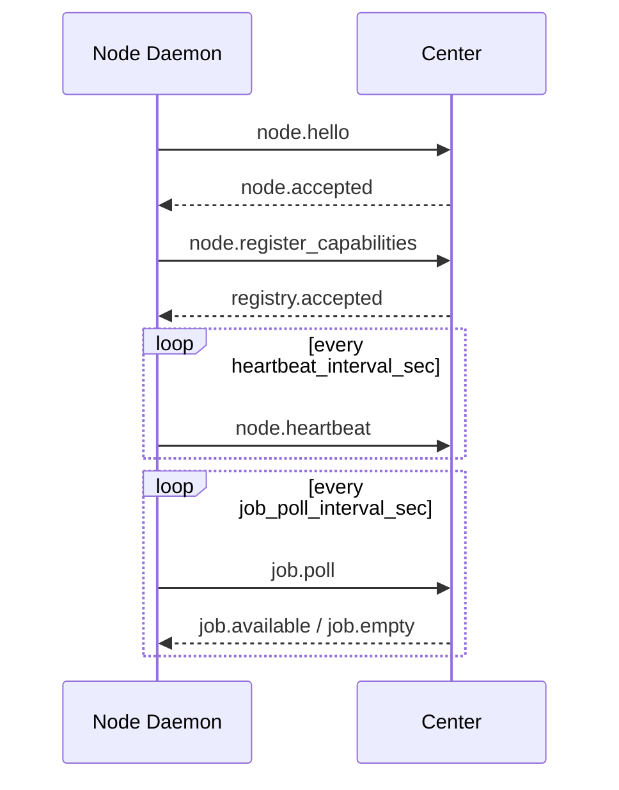

# YeQu Protocol (YQP)

版本：v0.1  
状态：当前 Center 实现合同（基于 `src/yequ/api/routes/yqp.py` 与 `src/yequ/services/node_service.py`）
目标读者：Windows Node、Linux Node、未来其他 Node Daemon 的开发者

本文是 Node 接入 Center 的权威协议文档。开发 Node 时，以本文和 `tests/test_yqp_protocol.py`、`tests/test_runtime_context.py` 为准；`docs/archive/*` 下的早期计划文档仅作历史参考。

## 1. 协议边界

YQP 是 Center 与 Node Daemon 之间的控制协议，用于：

- Node 身份认证与上线。
- Runtime 上报。
- Function / Signal 能力注册。
- Heartbeat 与 Signal 当前状态上报。
- Job 拉取、领取、执行事件、续租、终态上报。
- Node 重连后的 Job reconcile。

YQP 不定义具体业务能力。截图、摄像头、系统信息、Linux 命令等能力都应作为 Node capability 注册，Center 只根据 capability manifest 做策略、调度、审计和 Job 生命周期管理。

当前 Center 实现只支持 HTTP polling 形态：

- Node 调用 `POST /yqp/`。
- `POST /yqp` 也由代码注册，但部署层可能对尾斜杠行为有差异；Node 实现应优先使用 `/yqp/`。
- WebSocket push 尚未实现，不应作为 Node 开发依赖。

## 2. 认证

所有 Node 请求必须带 Bearer token：

```http
Authorization: Bearer <node_token>
```

Center 先通过 token 找到已预配置的 Node，再校验 envelope 中的 `node_id` 是否与 token 绑定的 Node 一致。

当前行为：

- 缺少 token：HTTP 401。
- token 无效：HTTP 401。
- `node_id` 与 token 不匹配：HTTP 403。
- Node 未预配置：不能通过 `node.hello` 自动加入。

Node token 不放入 YQP payload。

## 3. Envelope

所有请求和响应都使用统一 envelope。

```json
{
  "yqp_version": "0.1",
  "message_id": "msg_01H...",
  "message_type": "node.heartbeat",
  "trace_id": "tr_01H...",
  "node_id": "linuxServer",
  "session_id": null,
  "timestamp": "2026-06-28T12:00:00Z",
  "payload": {}
}
```

| 字段 | 必填 | 当前约束 |
|---|---:|---|
| `yqp_version` | 是 | 当前只支持 `"0.1"`。 |
| `message_id` | 是 | 5 分钟去重窗口内必须唯一。重复消息返回 HTTP 409。 |
| `message_type` | 是 | 必须是 Center 支持的 YQP message type。 |
| `trace_id` | 是 | 用于链路追踪。 |
| `node_id` | 是 | Node 消息必须提供，且必须匹配 token 绑定的 Node。 |
| `session_id` | 否 | 当前 Node 协议路径不依赖该字段。 |
| `timestamp` | 是 | 默认允许与 Center 时间相差 30 秒。 |
| `payload` | 是 | 业务载荷，默认为对象。 |

响应 envelope 当前复用请求的 `message_id` 和 `trace_id`，并写入 Center 的 `timestamp` 与认证后的 `node_id`。

## 4. Message Types

当前 Center 路由支持以下请求：

| 请求 `message_type` | 响应 `message_type` | 用途 |
|---|---|---|
| `node.hello` | `node.accepted` | Node 上线与参数协商。 |
| `node.heartbeat` | `node.heartbeat` | 心跳与 runtime 快照同步。 |
| `node.register_capabilities` | `registry.accepted` | 注册 Function / Signal 全量快照。 |
| `signal.report` | `signal.report` | 上报 Signal 当前值。 |
| `job.poll` | `job.available` 或 `job.empty` | 拉取可执行 Job。 |
| `job.accepted` | `job.accepted` | Node 确认领取 Job，Center 将 Job 置为 running。 |
| `job.event` | `job.event` | 上报进度、日志、取消中等事件。 |
| `job.finished` | `job.finished` | 上报 Job 终态。 |
| `job.lease_renew` | `job.lease_accepted` | Job 续租。payload 内可能表示 denied。 |
| `job.cancel` | `job.cancel` | Center/Node 取消路径的协议入口，通常 Node 只需执行取消后上报事件和终态。 |
| `node.reconcile_jobs` | `job.reconciliation` | 重连后对齐本地 Job 状态。 |

注意：`job.dispatch`、WebSocket push 当前只是枚举中保留的未来形态，不是当前实现合同。

## 5. 启动流程

Linux/Windows Node 的最小启动流程：



Daemon 重启或断线恢复后，应重新执行 `node.hello` 和 `node.register_capabilities`，然后再发送 `node.reconcile_jobs`。

## 6. node.hello

请求：

```json
{
  "message_type": "node.hello",
  "node_id": "linuxServer",
  "payload": {
    "daemon_version": "0.1.0",
    "platform": {
      "os": "linux",
      "arch": "x86_64"
    },
    "runtimes": [
      {
        "runtime_id": "default",
        "kind": "privileged",
        "status": "online",
        "interactive": false,
        "labels": ["linux", "shell"],
        "metadata": {
          "python": "3.12"
        }
      }
    ]
  }
}
```

Center 当前会保存：

- `daemon_version`
- `platform.os`
- `platform.arch`
- Node status = `online`
- `last_seen_at`
- runtime 快照

响应：

```json
{
  "message_type": "node.accepted",
  "payload": {
    "heartbeat_interval_sec": 10,
    "heartbeat_timeout_multiplier": 3,
    "signal_report_interval_sec": 5,
    "signal_stale_multiplier": 3,
    "job_delivery_mode": "poll",
    "job_poll_interval_sec": 3,
    "server_time": "2026-06-28T12:00:00+00:00"
  }
}
```

Node 必须以响应值为运行参数，不要硬编码 poll/heartbeat 周期。

## 7. Runtime Snapshot

Runtime 表示 Node 内部的平台无关执行上下文。Center 用它匹配 capability 的 `execution_requirements`。

Runtime 字段：

| 字段 | 说明 |
|---|---|
| `runtime_id` | Node 内唯一。不同 Node 可以使用相同 `runtime_id`。 |
| `kind` | 建议值：`privileged`、`interactive`、`wasm`、`docker`。 |
| `status` | `online`、`degraded`、`offline`。可调度值为 `online` 或 `degraded`。 |
| `interactive` | 是否需要桌面/用户会话。截图、摄像头应为 `true`。 |
| `privilege` | 可选，例如 `user`、`admin`、`root`。 |
| `labels` | 可选标签，用于 capability 匹配。 |
| `owner` | 可选。 |
| `metadata` | 可选，不参与通用调度语义。 |

`node.hello`、`node.heartbeat`、`node.register_capabilities` 都可以携带 `runtimes`。Center 将它视为当前 Node 的 runtime 全量快照：本次未上报且原本 `online` 的 runtime 会被标记为 `offline`。

如果不携带 `runtimes`，Center 当前不会删除旧 runtime，只会记录 warning。新 Node 开发应始终上报至少一个 runtime。

### 7.1 Runtime 权限声明原则

`runtime.privilege`、`runtime.labels` 和 `runtime.metadata` 是调度合同的一部分，不只是展示信息。Center 会根据 capability 的 `execution_requirements` 匹配 runtime，但 Center 不验证 Linux/Windows 本地 OS 权限。

Node 是 runtime 权限声明的事实来源。Node 只能上报自己已经本地验证过的 runtime 权限，不能声明实际不可执行的权限能力。

如果某个 capability 依赖特定 OS 权限，Node 必须在注册 capability 前完成本地 permission probe：
- probe 通过：注册 capability，并声明对应 `execution_requirements`。
- probe 不通过：不要注册该 capability，或将所属 plugin/capability 标记为 error。
- 执行时仍遇到权限问题：必须返回 `job.finished(status="failed")`，错误码使用 `permission_denied`，不得返回空结果或伪成功。

高权限能力必须与普通能力分开建模。不要让普通 read capability 在内部偷偷提权。需要 sudo/root 的能力应注册为独立 capability，并匹配独立 runtime。

## 8. Capability Registration

`node.register_capabilities` 是当前 Node 能力的全量快照。Center 当前按 `(node, plugin_id)` 先停用旧能力，再插入本次 manifest 中的 function/signal。

请求：

```json
{
  "message_type": "node.register_capabilities",
  "node_id": "linuxServer",
  "payload": {
    "runtimes": [
      {
        "runtime_id": "default",
        "kind": "privileged",
        "status": "online",
        "interactive": false,
        "labels": ["linux", "shell"]
      }
    ],
    "plugins": [
      {
        "plugin_id": "linux.system",
        "plugin_version": "0.1.0",
        "functions": [
          {
            "name": "linux.system.info",
            "description": "Return OS, kernel, uptime, CPU and memory summary.",
            "agent_description": "Inspect basic Linux host information.",
            "input_schema": {
              "type": "object",
              "properties": {},
              "additionalProperties": false
            },
            "output_schema": {
              "type": "object"
            },
            "risk": "safe",
            "effect": "read",
            "timeout_sec": 5,
            "idempotency": "idempotent",
            "execution_requirements": {
              "runtime_kind": "privileged",
              "labels": ["linux"]
            }
          }
        ],
        "signals": [
          {
            "name": "linux.system.load",
            "scope": "node",
            "ttl_sec": 30,
            "value_schema": {
              "type": "object"
            }
          }
        ]
      }
    ]
  }
}
```

响应：

```json
{
  "message_type": "registry.accepted",
  "payload": {
    "registered_count": 2,
    "failed_count": 0,
    "accepted_at": "2026-06-28T12:00:00+00:00"
  }
}
```

### 8.1 Function Manifest

| 字段 | 必填 | 说明 |
|---|---:|---|
| `name` | 是 | 全局 function 名称。建议带平台/领域前缀，如 `linux.system.info`。 |
| `description` | 否 | 面向人类/API 的描述。 |
| `agent_description` | 否 | 面向 Agent 的更短、更明确描述。 |
| `user_visible_name` | 否 | 前端可显示名称。 |
| `input_schema` | 是 | JSON Schema。 |
| `output_schema` | 否 | JSON Schema。 |
| `risk` | 是 | `safe`、`maintenance`、`destructive`、`catastrophic`。 |
| `effect` | 是 | `read`、`write`、`destructive`、`external`。 |
| `timeout_sec` | 否 | 默认由 Center 使用 30 秒。 |
| `idempotency` | 否 | `idempotent`、`non_idempotent`、`transactional`。 |
| `resource_keys` | 否 | 用于资源锁和并发控制。 |
| `conflict_policy` | 否 | `allow_parallel`、`serialize`、`reject_if_running`。 |
| `execution_context` | 否 | 兼容简写：`system`、`user`、`hybrid`。 |
| `execution_requirements` | 否 | 推荐使用。匹配 runtime 的平台无关要求。 |
| `hidden_input_fields` | 否 | 不暴露给 Agent 的内部字段。 |
| `preflight_supported` | 否 | 是否支持 dry-run/preflight。 |

`execution_context` 映射：

| `execution_context` | 映射结果 |
|---|---|
| `system` | `{"runtime_kind": "privileged"}` |
| `user` | `{"runtime_kind": "interactive", "interactive": true}` |
| `hybrid` | `{"runtime_kind": "interactive", "fallback_runtime_kind": "privileged"}` |

新 capability 推荐直接写 `execution_requirements`，避免平台语义混入 Center。

### 8.2 Signal Manifest

| 字段 | 必填 | 说明 |
|---|---:|---|
| `name` | 是 | Signal 名称。 |
| `scope` | 否 | `node`、`plugin`、`resource`。 |
| `ttl_sec` | 否 | Center 标记 stale 的 TTL。 |
| `value_schema` | 否 | Signal value 的 JSON Schema。 |

## 9. node.heartbeat

请求：

```json
{
  "message_type": "node.heartbeat",
  "node_id": "linuxServer",
  "payload": {
    "daemon_uptime_sec": 3600,
    "running_jobs": ["job_01H..."],
    "plugin_count": 2,
    "status": "online",
    "runtimes": [
      {
        "runtime_id": "default",
        "kind": "privileged",
        "status": "online",
        "interactive": false,
        "labels": ["linux", "shell"]
      }
    ]
  }
}
```

当前 Center 只将 heartbeat 作为 liveness 事实来源：

- 更新 `last_seen_at` 和 `last_heartbeat_at`。
- 同步 runtime 快照。
- 如果 Node 原本是 `offline` 或 `rejoining`，恢复为 `online` 并写 timeline。

`running_jobs`、`plugin_count` 目前是观测字段，不会反向修改 Center 的 Job/Capability 状态。

响应 payload 当前为空对象 `{}`。

## 10. signal.report

请求：

```json
{
  "message_type": "signal.report",
  "node_id": "linuxServer",
  "payload": {
    "signals": [
      {
        "name": "linux.system.load",
        "scope": "node",
        "value": { "load1": 0.42, "load5": 0.38 },
        "collected_at": "2026-06-28T12:00:00Z",
        "ttl_sec": 30
      }
    ]
  }
}
```

当前行为：

- 如果已注册 signal 且有 `value_schema`，Center 校验 `value`。
- 校验失败的 signal 不写入 `SignalState`，计入 `rejected`。
- 校验成功的 signal 写入/更新 `SignalState`。
- `expires_at` 当前按 Center 接收时间 `now + ttl_sec` 计算，而不是 `collected_at + ttl_sec`。
- signal stale 会影响 SignalState 查询结果；Node degraded 当前主要由 heartbeat 年龄计算，不由 signal stale 直接驱动。

响应：

```json
{
  "message_type": "signal.report",
  "payload": {
    "accepted": 1,
    "rejected": 0
  }
}
```

## 11. job.poll

Node 按 `job_poll_interval_sec` 主动拉取 Job。

请求：

```json
{
  "message_type": "job.poll",
  "node_id": "linuxServer",
  "payload": {
    "capacity": 2,
    "running_jobs": ["job_01H..."]
  }
}
```

Center 计算：

```text
available_slots = max(capacity - len(running_jobs), 0)
```

如果有可执行 Job，响应 `job.available`：

```json
{
  "message_type": "job.available",
  "node_id": "linuxServer",
  "payload": {
    "jobs": [
      {
        "job_id": "job_01H...",
        "invocation_id": "inv_01H...",
        "function": "linux.system.info",
        "input": {},
        "runtime_id": "default",
        "execution_requirements": {
          "runtime_kind": "privileged",
          "labels": ["linux"]
        },
        "timeout_sec": 5,
        "lease_sec": 30,
        "approval_id": null,
        "resource_keys": [],
        "dry_run": false
      }
    ]
  }
}
```

Center 在返回 Job 前会将 Job 从 `queued` 转为 `claimed` 并设置 lease。

如果没有 Job 或没有空闲 capacity，响应 `job.empty`：

```json
{
  "message_type": "job.empty",
  "node_id": "linuxServer",
  "payload": {
    "jobs": []
  }
}
```

当前实现不会返回 HTTP 204。

## 12. job.accepted

Node 开始执行 Job 前必须发送 `job.accepted`。

```json
{
  "message_type": "job.accepted",
  "node_id": "linuxServer",
  "payload": {
    "job_id": "job_01H..."
  }
}
```

当前 Center 只接受 `claimed -> running`。如果 Job 不属于该 Node、不存在或状态不合法，返回 404/409。

响应：

```json
{
  "message_type": "job.accepted",
  "payload": {
    "job_id": "job_01H...",
    "status": "accepted"
  }
}
```

## 13. job.event

执行过程中可上报进度/日志/取消中事件。

```json
{
  "message_type": "job.event",
  "node_id": "linuxServer",
  "payload": {
    "job_id": "job_01H...",
    "event_type": "job.progress",
    "sequence": 1,
    "data": {
      "message": "collecting system info"
    }
  }
}
```

当前 Center 将该事件写入 Timeline，不改变 Job 状态。状态变化必须通过 `job.accepted` 或 `job.finished`。

建议事件类型：

- `job.started`
- `job.progress`
- `job.log`
- `job.cancelling`
- `job.timeout`

响应：

```json
{
  "message_type": "job.event",
  "payload": {
    "job_id": "job_01H...",
    "event_type": "job.progress",
    "sequence": 1
  }
}
```

## 14. job.finished

Job 完成后上报终态。

```json
{
  "message_type": "job.finished",
  "node_id": "linuxServer",
  "payload": {
    "job_id": "job_01H...",
    "status": "succeeded",
    "output": {
      "ok": true
    }
  }
}
```

合法终态：

- `succeeded`
- `failed`
- `cancelled`
- `timeout`

失败可使用 flat error 或 nested error：

```json
{
  "job_id": "job_01H...",
  "status": "failed",
  "error_code": "command_failed",
  "error_message": "exit code 1"
}
```

或：

```json
{
  "job_id": "job_01H...",
  "status": "failed",
  "error": {
    "code": "command_failed",
    "message": "exit code 1",
    "details": {
      "stderr": "..."
    }
  }
}
```

终态不可覆盖。第二次 `job.finished` 会返回 HTTP 409。

当前 Job output 仍是 JSON 字段。截图、摄像头照片、录屏等二进制结果不应长期 base64 塞进 output；正式能力应先补 Center Artifact API，再在 output 中返回 artifact 引用。

## 15. job.lease_renew

长任务应在 lease 过半前续租。

```json
{
  "message_type": "job.lease_renew",
  "node_id": "linuxServer",
  "payload": {
    "job_id": "job_01H...",
    "lease_extend_sec": 30
  }
}
```

接受响应：

```json
{
  "message_type": "job.lease_accepted",
  "payload": {
    "job_id": "job_01H...",
    "status": "accepted",
    "lease_expires_at": "2026-06-28T12:00:30+00:00"
  }
}
```

当前实现中，即使续租被拒绝，响应 envelope 的 `message_type` 仍由路由映射为 `job.lease_accepted`，payload 内会标记：

```json
{
  "message_type": "job.lease_accepted",
  "payload": {
    "job_id": "job_01H...",
    "status": "denied",
    "reason": "job_not_running"
  }
}
```

Node 必须以 payload 的 `status` 为准。

## 16. job.cancel

当前 Center 暴露 `job.cancel` handler，但 poll 模式下没有单独的 server-push cancel 通道。Node 实现至少应做到：

- 在执行循环中检查本地取消标记。
- 如果本地决定取消，先上报 `job.event(event_type="job.cancelling")`。
- 最终用 `job.finished(status="cancelled")` 收尾。

未来如果 Center 通过独立通道推送 cancel，Node 也应执行同样的事件和终态路径。

## 17. node.reconcile_jobs

Node 重连后应上报本地仍在运行或已完成但不确定 Center 是否收到的 Job。

```json
{
  "message_type": "node.reconcile_jobs",
  "node_id": "linuxServer",
  "payload": {
    "known_jobs": [
      {
        "job_id": "job_01H...",
        "local_status": "running",
        "started_at": "2026-06-28T12:00:00Z",
        "updated_at": "2026-06-28T12:00:10Z"
      },
      {
        "job_id": "job_02H...",
        "local_status": "succeeded",
        "output": {
          "ok": true
        }
      }
    ]
  }
}
```

`local_status` 可为：

- `running`
- `succeeded`
- `failed`
- `cancelled`
- `timeout`

响应：

```json
{
  "message_type": "job.reconciliation",
  "payload": {
    "actions": [
      {
        "job_id": "job_01H...",
        "action": "continue",
        "lease_sec": 30
      },
      {
        "job_id": "job_02H...",
        "action": "accept_result",
        "reconciled": true
      }
    ]
  }
}
```

Action 语义：

| action | Node 行为 |
|---|---|
| `continue` | 继续执行，并按 lease 续租。 |
| `cancel` | 停止本地任务，并最终上报 cancelled/failed。 |
| `accept_result` | Center 已接收本地终态，Node 可清理本地缓存。 |
| `discard_result` | Center 已有终态，Node 必须丢弃本地迟到结果并清理。 |
| `forget` | Center 不认识该 Job，Node 应停止并清理。 |

当前 Center 终态是权威事实来源。Center 已终态时，迟到的 Node 结果会被 `discard_result`。

## 18. 错误响应

协议错误通过 HTTP 状态码加 `detail` 返回，`detail` 是 YQP error 对象：

```json
{
  "detail": {
    "code": "schema_invalid",
    "message": "Invalid YQP envelope: ...",
    "retryable": false,
    "details": {}
  }
}
```

常见错误：

| HTTP | code | 典型原因 |
|---:|---|---|
| 400 | `schema_invalid` | 缺字段、未知 message type、非法终态、时间戳超窗。 |
| 401 | `auth_failed` | 缺少或无效 token。 |
| 403 | `auth_failed` | token 与 `node_id` 不匹配。 |
| 404 | `job_not_found` | Job 不存在或不属于该 Node。 |
| 409 | `duplicate_message` | `message_id` 重复。 |
| 409 | `invalid_state_transition` | Job 状态机不允许该转换。 |
| 422 | `schema_invalid` | Envelope pydantic 校验失败。 |

Node 实现原则：

- 对同一消息重试时不要复用已被 Center 接收的 `message_id`，除非明确希望触发重复检测。
- 对 4xx 协议错误不要盲目快速重试。
- 对网络超时可使用新的 `message_id` 重试，但要避免重复执行本地副作用；Job 终态上报前应持久化本地执行结果。

## 19. Linux Node 最小实现要求

开发 Linux node POC 时，至少实现：

1. 读取配置：`center_base_url`、`node_id`、`node_token`、`yqp_path=/yqp/`。
2. 统一 envelope builder：生成唯一 `message_id`、稳定 `trace_id`、UTC timestamp。
3. `node.hello`：上报 platform 与至少一个 runtime。
4. `node.register_capabilities`：注册最小 Linux capabilities。
5. 周期 heartbeat：按 `node.accepted` 返回的 interval。
6. 周期 job poll：按 `job_poll_interval_sec`。
7. Job 执行状态机：
   - 收到 `job.available` 后本地记录 Job。
   - 发送 `job.accepted`。
   - 执行本地 function。
   - 成功发送 `job.finished(status="succeeded")`。
   - 失败发送 `job.finished(status="failed", error=...)`。
8. 长任务续租：超过 lease 一半的任务必须 `job.lease_renew`。
9. 重启恢复：本地保留未确认终态 Job，启动后发送 `node.reconcile_jobs`。

建议第一批 Linux capabilities：

| name | risk | effect | runtime |
|---|---|---|---|
| `linux.system.info` | `safe` | `read` | `privileged` |
| `linux.metrics.snapshot` | `safe` | `read` | `privileged` |
| `linux.process.list` | `safe` | `read` | `privileged` |
| `linux.filesystem.stat` | `safe` | `read` | `privileged` |

暂不建议第一版实现任意 shell 写操作。若要实现命令执行，必须拆成：

- `linux.shell.exec.readonly`：只允许白名单只读命令。
- `linux.shell.exec`：`risk=maintenance` 或更高，`effect=write/external`，需要审批策略覆盖。

## 20. 当前不支持或不应依赖的能力

- 不支持 WebSocket job push。
- 不支持 Node 主动自动注册到 Center，必须先由 Admin provisioning 创建 node/token。
- 不支持二进制 artifact 的通用上传协议。截图/摄像头正式实现前应先补 Artifact API。
- 不支持按 Signal stale 自动把 Node 标记为 degraded；当前调度主要看 heartbeat liveness。
- 不支持在 YQP payload 中传 node token。
