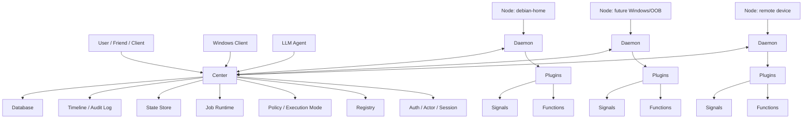
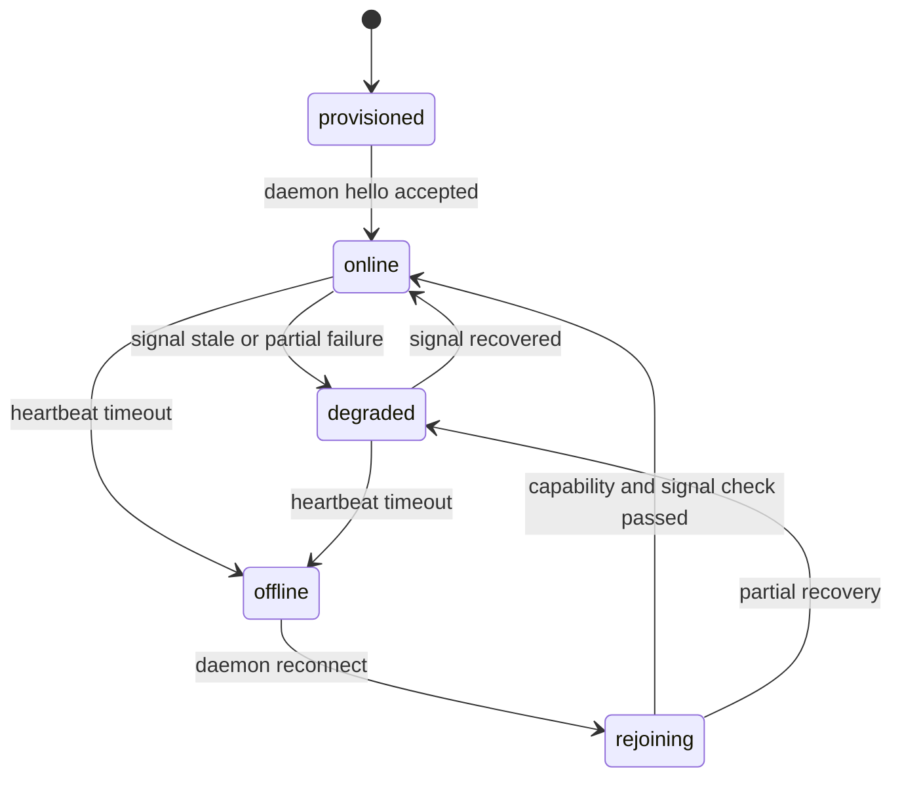
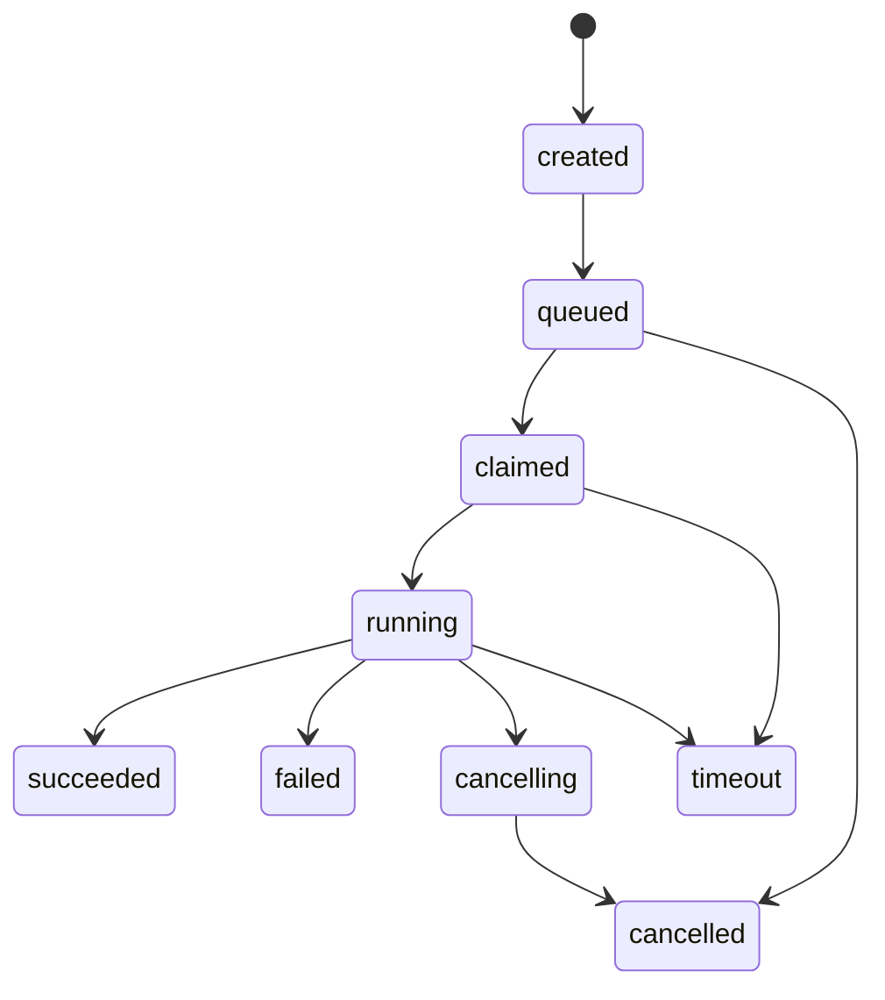
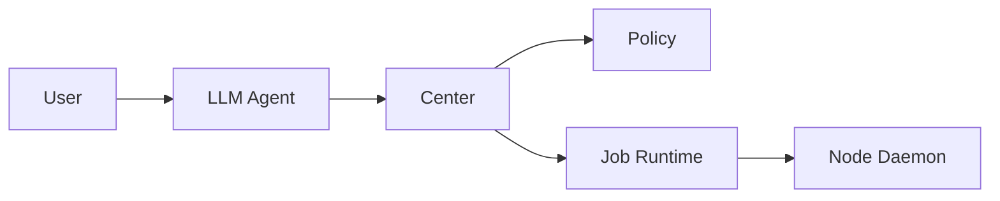
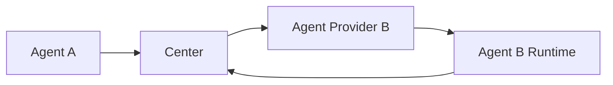
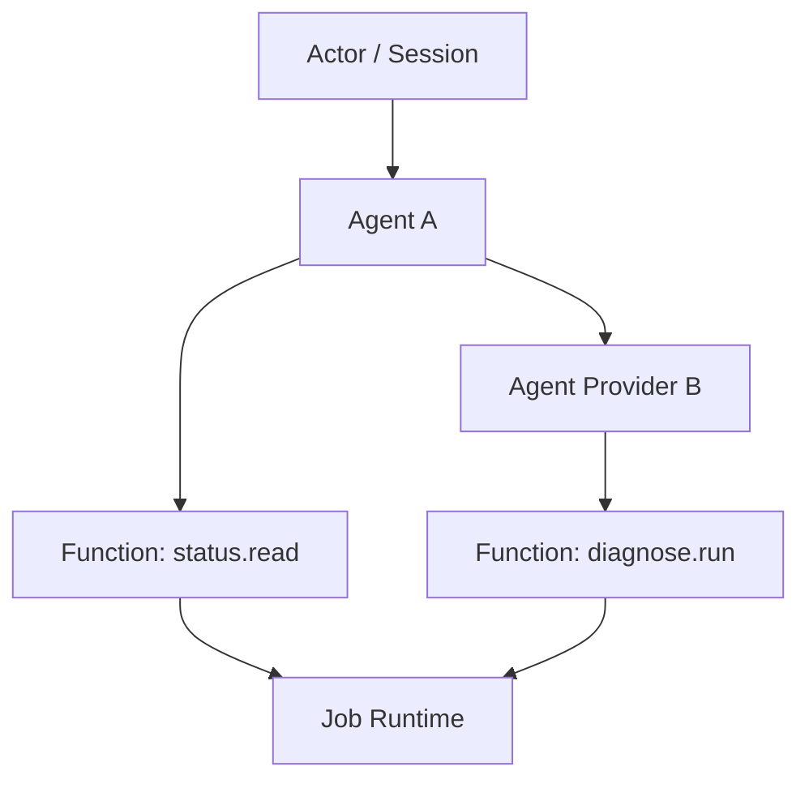
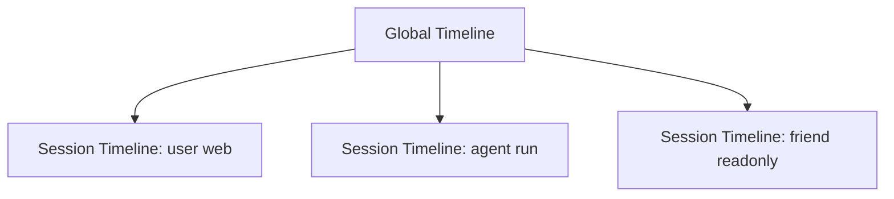
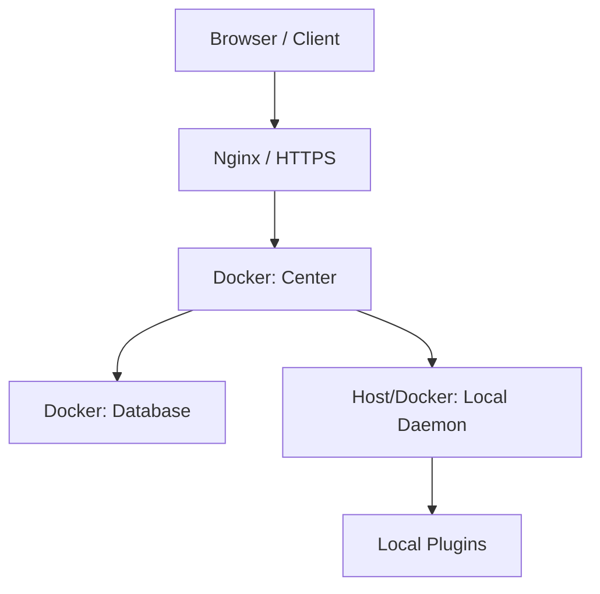

# YeQu Center Architecture Design

版本：v0.1  
状态：架构设计草案  
目标读者：项目作者、后续客户端/Node/Agent 开发者  

## 1. 设计目标

YeQu Center 是一个面向个人基础设施的控制中心。它负责接入不同设备、收集状态、调度能力、记录审计时间线，并为未来的 LLM Agent、Web 控制台、Windows 客户端和移动端提供统一访问入口。

本系统的核心不是某个具体服务，而是一个可扩展的基础设施控制框架。文件服务、博客服务、远程开发服务、下载服务、通知服务、家庭设备服务都应作为后续可接入对象，而不是核心架构的一部分。

### 1.1 当前现实约束

| 约束 | 影响 |
|---|---|
| Center 首期部署在 `debian-home` | 控制面和主要执行面同宿主，需要先用 Docker 做逻辑隔离。 |
| 阿里云服务器带宽较低 | 阿里云更适合作为入口、反代、中继或轻量状态面，不适合承载重数据面。 |
| Laptop 不希望常驻开发环境 | Windows/Laptop 侧更适合作为客户端或轻量 Node，不作为主要执行端。 |
| 远端 Node 可能上下线 | Node 状态、心跳、Signal 新鲜度必须纳入系统模型。 |
| 后续会接入 LLM Agent | Agent 必须通过 Center 的标准调用路径访问能力。 |
| 未来可能开放给朋友使用 | 用户、Session、权限、审计时间线必须从架构层保留。 |

## 2. 总体架构



### 2.1 分层说明

| 层 | 职责 | 不负责 |
|---|---|---|
| Center | 认证、注册、调度、状态、审计、策略、任务生命周期 | 具体服务的业务实现 |
| Node | 表示一个可接入执行环境 | 决策、权限裁决 |
| Daemon | 常驻在 Node 上，执行 Center 下发的 Job，持续上报 Signal | LLM 推理 |
| Plugin | 将本地系统或服务能力转换为 Function/Signal | 跨用户授权、全局调度 |
| Agent | LLM 驱动的调用者或编排者 | 直接访问设备或绕过 Center |
| Client | Web、Windows、移动端等用户入口 | 直接执行 Node 能力 |

## 3. 核心概念

| 概念 | 定义 |
|---|---|
| Center | 系统核心控制面。 |
| Node | 设备、主机、虚拟环境或其他可执行端。 |
| Daemon | Node 上运行的非 LLM 常驻程序。 |
| Plugin | 能力适配模块。 |
| Function | 主动调用型能力。 |
| Signal | 持续上报型状态。 |
| Resource | 被 Function 或 Signal 描述的对象。 |
| Actor | 调用主体，包括用户、Agent、系统服务。 |
| Session | 一次交互上下文。 |
| Invocation | Actor 发起的一次语义调用。 |
| Job | Runtime 创建的实际执行任务。 |
| Event | Job、Signal、审批、状态变化产生的时间线记录。 |

## 4. Node 模型

Node 是系统接入外部执行能力的边界。首期最重要的 Node 是 `debian-home`，后续可以接入 OOB 节点、Windows 设备、云端设备或其他机器。

### 4.1 Node 分类

| 字段 | 示例 | 说明 |
|---|---|---|
| `node_id` | `debian-home` | 全局唯一标识。 |
| `role` | `center-host`, `compute`, `recovery`, `client` | Node 在系统中的角色。 |
| `locality` | `local`, `lan`, `wan` | 与 Center 的位置关系。 |
| `status` | `online`, `degraded`, `offline`, `rejoining` | 当前状态。 |
| `last_seen_at` | 时间戳 | 最近一次有效心跳。 |

### 4.2 Node 状态机



### 4.3 断连处理原则

| 场景 | Center 行为 |
|---|---|
| Node 心跳超时 | 标记为 `offline`，保留历史状态和能力元数据。 |
| Signal 过期 | 标记对应状态为 `stale`，避免自动化决策依赖过期值。 |
| Node 重连 | 进入 `rejoining`，完成身份校验和能力重报后恢复。 |
| Job 执行中断 | Runtime 根据 lease/timeout 标记为 `timeout` 或 `failed`。 |

心跳超时阈值由协议协商值决定，默认按 `heartbeat_interval_sec * heartbeat_timeout_multiplier` 计算。Signal stale 不等价于 Node offline：当心跳仍正常但关键 Signal 过期、Plugin 部分失败或能力不完整时，Node 应进入 `degraded`；当心跳也超时时，Node 才进入 `offline`。

### 4.4 重连仲裁原则

Center 是 Node 状态、Job 控制状态和审计时间线的事实来源。Daemon 是本地执行事实的来源。两者在断连后发生分歧时，按以下原则处理：

| 分歧 | 仲裁规则 |
|---|---|
| Center 认为 Job running，Daemon 认为 running | Center 重新发放 lease，Job 继续执行。 |
| Center 认为 Job running，Daemon 已完成 | Center 接受终态结果并写入 Timeline。 |
| Center 已将 Job timeout/cancelled，Daemon 后续上报 succeeded | Center 不直接覆盖终态，先记录 reconciled 事件，再按 Function 的副作用和幂等性决定是否接受结果。 |
| Center 不认识 Daemon 上报的 Job | Daemon 停止并清理该 Job，本地结果只作为异常审计材料。 |

Daemon 在断连期间可以继续执行已经持有有效 lease 的 Job；lease 过期后不得继续启动新的副作用步骤。对于不可安全中断的本地操作，Daemon 应尽量完成本地收尾，并在重连时通过 reconcile 上报结果。

## 5. Plugin、Function 与 Signal

Plugin 是能力适配层。它可以封装本地系统 API、服务 API、命令行工具、文件系统操作或其他业务服务。Center 面向 Function 和 Signal 工作，不直接理解业务内部结构。

### 5.1 Function

Function 是主动调用型能力。它由 Plugin 提供，通过 Center 的 Runtime 执行。

| 元数据 | 说明 |
|---|---|
| `name` | 全局函数名，建议采用 `domain.resource.action`。 |
| `input_schema` | 输入结构约束。 |
| `output_schema` | 输出结构约束。 |
| `risk` | 风险等级。 |
| `effect` | 只读、维护、破坏性等副作用分类。 |
| `timeout` | 默认执行超时。 |
| `idempotency` | 是否适合重试或去重。 |
| `resource_keys` | 可选。Function 涉及的资源键，用于锁、串行化和审计。 |
| `conflict_policy` | 可选。资源冲突策略，如允许并行、串行执行或冲突即拒绝。 |

### 5.2 Signal

Signal 是持续上报型状态。它用于描述 Node、Resource 或服务的实时状态。

| 元数据 | 说明 |
|---|---|
| `name` | Signal 名称。 |
| `scope` | 作用对象，如 Node、Resource、Plugin。 |
| `ttl` | 有效时间。 |
| `collected_at` | 采集时间。 |
| `reported_at` | 上报时间。 |
| `freshness` | `fresh` 或 `stale`。 |
| `value_schema` | 值的结构和范围约束。 |

Signal 的值必须经过 schema 校验后才能进入 State Store。State Store 只保存当前可信状态；异常值、过期值和 schema 校验失败应进入 Timeline/Audit，供诊断使用。

### 5.3 Function 与 Signal 的差异

| 维度 | Function | Signal |
|---|---|---|
| 触发方式 | Actor 或 Center 主动触发 | Daemon/Plugin 持续上报 |
| 运行模型 | Invocation -> Job -> Event | Report -> State -> Event |
| 典型用途 | 查日志、执行检查、重启服务 | CPU、内存、在线状态、服务健康 |
| 时效语义 | 以 Job 结果为准 | 以 TTL 和 freshness 为准 |

## 6. Invocation 与 Job Runtime

Invocation 是调用意图，Job 是执行实体。一个 Invocation 可以产生一个或多个 Job，也可以在 Policy 阶段被拒绝。

一个 Invocation 产生多个 Job 的典型场景包括：同一个 Function 需要在多个 Node 上执行、一次高层操作拆分为多个资源步骤、Agent Provider 触发受控的子调用。Actor 面向 Invocation 观察整体结果；Runtime 面向 Job 追踪每个执行实体。

```mermaid
sequenceDiagram
    participant Actor
    participant Center
    participant Policy
    participant Runtime
    participant Daemon
    participant Timeline

    Actor->>Center: Invocation
    Center->>Policy: check actor/session/mode/risk
    Policy-->>Center: allow / deny / require approval
    Center->>Runtime: create Job
    Runtime->>Daemon: dispatch Function
    Daemon-->>Runtime: job events
    Daemon-->>Runtime: final result
    Runtime-->>Timeline: append events
    Timeline-->>Center: update state/audit view
    Center-->>Actor: result or event stream
```

### 6.1 Job 状态机



### 6.2 Runtime 需要保证的行为

| 行为 | 说明 |
|---|---|
| lease | Daemon 领取 Job 后必须周期续租。 |
| timeout | Job 必须有最大执行时间。 |
| cancel | 支持取消运行中 Job。 |
| event close | Job 进入终态后关闭该 Job 的事件流。 |
| result durability | 终态结果进入 Timeline 和 Audit。 |

### 6.3 Invocation 聚合与失败传播

当一个 Invocation 包含多个 Job 时，Runtime 必须维护 Invocation 级聚合状态：

| 情况 | Invocation 结果 |
|---|---|
| 所有必需 Job 成功 | `succeeded`。 |
| 任一必需 Job 失败且不可降级 | `failed`，失败原因指向具体 Job。 |
| 任一必需 Job timeout | `timeout`，未完成 Job 进入取消或恢复流程。 |
| 用户或上层策略取消 | `cancelled`，Runtime 尽力取消所有未终止 Job。 |
| 部分可选 Job 失败 | `partial` 或 `succeeded_with_warnings`，由调用方 schema 定义。 |

Timeline 必须保留 Invocation 和每个 Job 的关联，避免只看到顶层结果而无法追溯中间失败。

### 6.4 资源冲突控制

Center 负责跨用户、跨 Agent 和跨自动化来源的资源冲突控制。首期采用 Function manifest 中的 `resource_keys` 和 `conflict_policy` 做保守调度：

| 策略 | 行为 |
|---|---|
| `allow_parallel` | 允许并行执行，适合纯读或无共享资源操作。 |
| `serialize` | 同一资源键上的 Job 串行执行。 |
| `reject_if_running` | 同一资源键已有运行 Job 时拒绝新 Invocation。 |

未声明资源键的写操作应按高风险处理：要么进入人工确认，要么落入该 Function 的全局串行队列。

### 6.5 Center 恢复

Center 重启后必须从持久化存储恢复未完成 Job、Node Registry、最近 Node 状态和 Timeline 游标。持久化最低要求：

| 数据 | 持久化要求 |
|---|---|
| Node 元数据和 token 绑定 | 必须持久化。 |
| Capability Registry | 必须持久化最近一次全量快照。 |
| Invocation/Job created、queued、claimed、running、terminal 状态 | 必须持久化。 |
| Job 中间 progress/log | 可按容量策略持久化或采样。 |
| Job 终态结果 | 必须进入 Timeline/Audit。 |
| Session 当前内存态 | 可恢复为 closed/interrupted，但审计事件必须保留。 |

恢复流程：

1. Center 启动后加载未终止 Job，并将相关 Node 标记为 `rejoining` 或 `unknown`。
2. 在线 Daemon 重新 hello 和能力全量注册。
3. Daemon 发送 `node.reconcile_jobs`，Center 按仲裁规则返回 reconciliation actions。
4. 超过恢复窗口仍未出现的 Node，其 running Job 按 lease/timeout 规则进入终态。

## 7. 执行模式与风险模型

执行模式用于限制 Actor 在一次 Session 中的可执行范围。它是策略输入，不是 Function 自身属性。

### 7.1 执行模式

| 模式 | 语义 | 适用场景 |
|---|---|---|
| `auto` | 自动执行除灾难级动作外的大多数操作 | 个人高信任自动化 |
| `assist` | 自动执行低风险和可回退动作，超出范围转人工确认 | 常规排查和半自动运维 |
| `readonly` | 只允许读取状态、日志和历史信息 | 访客、排查、演示 |
| `manual` | 写操作全部需要人工确认 | 高敏感会话 |

### 7.2 风险分级

| 风险 | 示例 | 默认处理 |
|---|---|---|
| `safe` | 读取状态、读日志、查看历史 | 可在所有模式执行 |
| `maintenance` | 重启非关键服务、刷新配置、触发健康检查 | `auto` 可执行，`assist` 需满足白名单 |
| `destructive` | 重启机器、断电、密钥轮换、删除资源 | 需要人工确认 |
| `catastrophic` | 清空数据库、不可逆破坏、凭据泄露风险操作 | 默认禁止，需独立流程 |

### 7.3 模式与风险矩阵

| 模式 \ 风险 | safe | maintenance | destructive | catastrophic |
|---|---:|---:|---:|---:|
| `auto` | allow | allow | ask | deny |
| `assist` | allow | conditional | ask | deny |
| `readonly` | allow | deny | deny | deny |
| `manual` | allow | ask | ask | deny |

## 8. Agent 集成模型

Agent 专指 LLM 驱动组件。Agent 可以作为 Actor 调用 Center，也可以通过 Agent Provider 暴露可调用能力。Agent 不能直接执行 Node 能力。

### 8.1 Agent 作为调用者



### 8.2 Agent 作为 Provider



Agent Provider 必须声明可调用函数、输入输出 schema、执行模式约束和最大调用深度。

Agent 调用仍然遵循 Invocation -> Job -> Timeline 路径。Agent 不能直接绕过 Policy 调用 Node，也不能用 Agent Provider 链路提升执行模式。

## 9. 调用依赖图

系统使用有向图约束 Agent、Provider、Function 之间的调用关系，避免循环调用和递归失控。



### 9.1 图约束

| 约束 | 说明 |
|---|---|
| DAG | 注册或运行时构造的调用图不得出现环。 |
| `call_path` | 每次 Invocation 记录已经过的 Provider/Function。 |
| `max_depth` | 限制 Agent 嵌套调用深度。 |
| `max_branching` | 限制一次计划展开的并发分支。 |
| `max_steps` | 限制单次 Agent 计划的步骤数。 |
| `max_total_duration` | 限制一次 Agent Session 或 Agent Invocation 的总耗时。 |

DAG 可以在注册时做静态校验，也可以在运行时随 Agent 选择动态扩展。运行时每次扩展调用图时，都必须检查 `call_path`、`max_depth`、`max_branching`、`max_steps` 和 `max_total_duration`。发现环或超过限制时，Center 返回受控错误，而不是继续调用。

Agent Provider 调用失败时，Center 返回包装后的标准错误，包含 provider、失败阶段、retryable 和原始错误摘要。是否重试由上层 Agent 或策略决定，Center 不应对非幂等 Agent 调用自动重试。

## 10. 多用户与 Session Timeline

系统支持多个用户、多个客户端、多个 Agent 会话并存。审计数据以全局时间线为事实来源，Session 时间线是全局时间线的投影视图。

Session 的创建、关闭、登录态绑定属于 Client/API 层，不属于 Node YQP 协议。YQP Envelope 中的 `session_id` 只用于把 Node 侧 Job/Event 关联回 Center 已存在的 Session。



### 10.1 Event 归属

| 字段 | 作用 |
|---|---|
| `global_seq` | 全局单调事件序号。 |
| `actor_id` | 谁触发了该事件。 |
| `session_id` | 属于哪个交互上下文。 |
| `invocation_id` | 属于哪次语义调用。 |
| `job_id` | 属于哪个执行任务。 |
| `node_id` | 与哪个 Node 相关。 |
| `timestamp` | 发生时间。 |

Session 不是隔离底层资源的锁。多个 Session 同时操作同一资源时，冲突由 Runtime 的资源冲突控制处理，审计上仍分别保留各自的 `actor_id`、`session_id` 和 `invocation_id`。

## 11. 首期部署形态



首期部署以跑通基本业务链为目标。Center 与主 Node 同宿主是现实约束，Docker 用于边界隔离。后续可将 Edge、OOB Node、远端 Node 分离部署。

### 11.1 演进路径

| 阶段 | 目标 |
|---|---|
| Phase 1 | Center、Local Daemon、Function、Signal、Job、Timeline 跑通。 |
| Phase 2 | 接入远端 Node，完善上下线与重连。 |
| Phase 3 | 接入 LLM Agent，支持 `readonly/assist/auto/manual` 模式。 |
| Phase 4 | 引入 Agent Provider 和调用图约束。 |
| Phase 5 | 阿里云 Edge/OOB 恢复能力增强。 |

## 12. 开发治理原则

| 场景 | 规则 |
|---|---|
| 数据库结构变更 | 使用版本化 migration。涉及数据删除、重建或不可逆变更时必须请求人工决策。 |
| 多进程更新 | 更新后执行关闭旧进程、启动新进程、健康检查、恢复任务消费的流程。 |
| 新增 Function | 定义 schema、risk、effect、timeout、idempotency。 |
| 新增 Signal | 定义采集来源、TTL、stale 语义和作用对象。 |
| 新增 Node | 定义身份、角色、locality、心跳和能力重报流程。 |
| 新增 Agent | 定义执行模式、可调用范围、最大调用深度和步骤限制。 |

## 13. 设计边界

Center 不绑定任何具体业务服务。具体服务通过 Plugin 暴露 Function 和 Signal。重数据、低带宽、实时协同等问题属于具体服务的数据面设计，Center 只负责调用、状态和审计语义。
