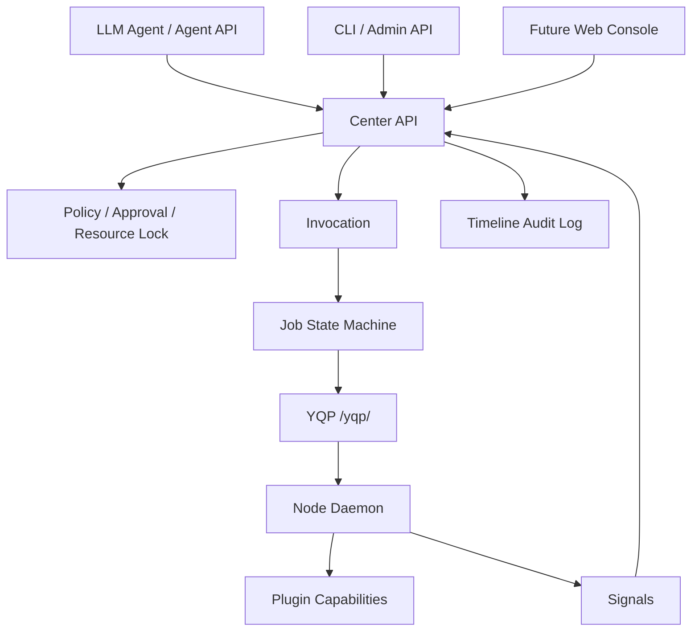

# YeQu Center 架构与重构交接文档（2026-06-27）

## 当前定位

YeQu Center 当前仍然符合“个人基础设施控制中心”的核心方向：Center 作为统一控制面，Node Daemon 作为设备侧执行面，Agent/CLI/Admin API 作为调用入口。项目不是简单的“Center=MCP Server、设备=MCP Client”，但可以把 MCP 理解为未来可对接的外部工具协议层；当前系统自己的核心协议是 YQP，且包含 MCP 本身没有覆盖的节点生命周期、作业状态机、审计时间线、审批、资源锁、维护计划等控制面能力。

## 当前架构事实

关键边界：

- Agent 不直接调用 Node，只能通过 Center 的 Invocation -> Job 路径。
- Node 不拥有调度权，只通过 YQP poll/claim/run/finish 报告执行状态。
- Center 负责策略、审批、资源锁、节点可调度性、任务生命周期和审计。
- Maintenance Plan 是 Center 侧业务编排，复用 Invocation/Job，不绕过标准执行路径。

## 本轮六阶段完成情况

1. 拉取远端小更新：已 fast-forward 到包含 DeepSeek retry/backoff 的最新远端提交。
2. 建立质量基线：记录 `docs/mypy-baseline-2026-06-27.txt` 和 `docs/mypy-debt-plan-2026-06-27.md`。
3. 清理低风险类型债务：CLI、JSON 字段、模型 JSON 列、共享 `JsonObject` 边界已统一。
4. 清理 SQLAlchemy 类型债务：DML result、nullable 时间字段、scalars materialize、approval/resource lock 边界已处理。
5. 清理 Agent/provider 动态类型债务：Provider/Fake/DeepSeek/AgentService/AgentStream 已进入 strict mypy。
6. 清理 Maintenance 与路由类型债务：Maintenance executor/service/API、approval API、agent SSE、app middleware、node service/liveness/resolver 已进入 strict mypy。

当前结果：`mypy src/` 已从 248 个初始错误降为 0 个错误。

## 本轮实际改动范围

- 新增共享类型边界：`src/yequ/types.py`
- 更新开发依赖：`types-jsonschema`
- Agent 侧：Provider DTO、DeepSeek SDK 边界、Fake provider、Agent service/stream 的动态 JSON 收窄。
- Center 侧：Node service、liveness、capability resolver、job state machine、approval/resource lock/maintenance executor 的类型边界。
- API 侧：Agent SSE、Maintenance API、Approval API、Admin schema、FastAPI middleware/static route 类型。
- 文档侧：mypy 基线、债务计划、当前交接文档。

## 与最初设计的一致点

- 多 Node 支持：保留并强化了按 Node 注册 Capability、按 Center 调度 Job、按 Node poll Job 的模型。
- 平台无关：Center 没有绑定 Windows/Linux/macOS 执行细节；平台相关逻辑仍应由 Node Plugin/Daemon 承担。
- Agent 解耦：Agent 侧只提交语义工具调用，执行路径仍由 Center 的 policy/resolver/job pipeline 统一处理。
- 审计完整性：状态变化继续依赖 TimelineEvent 与 Job state machine，不引入旁路调用。

## 当前仍需注意的风险

- `JsonObject` 现在是外部 JSON 边界类型，适合 API/YQP/LLM payload；内部核心领域对象不应继续扩大使用它。
- Maintenance executor 的业务流程复杂，虽然已通过类型检查，但仍建议补更多端到端场景测试，尤其是 approval resume/reject、rollback recommended 和 partial failure。
- Node service 仍是大文件，后续可按 YQP message handler 拆分，但本轮没有做行为性重构，避免扩大风险。
- MCP 适配仍未实现；如果要对外暴露 MCP，应作为 Center 上方的 adapter，而不是替换 YQP。

## 交接建议

下一轮优先级：

1. 对 Node service 做结构拆分：`lifecycle.py`、`capabilities.py`、`signals.py`、`jobs.py`、`reconcile.py`。
2. 将 YQP payload 从裸 JSON 逐步提升为 Pydantic message DTO，减少 handler 内部动态判断。
3. 为 Maintenance executor 增加端到端测试矩阵，覆盖 repair/verify/rollback/approval waiting。
4. 设计 MCP adapter：将 Center capabilities 映射为 MCP tools，但仍复用 Center policy/job/timeline。
5. 给 Console/Agent SSE 增加契约测试，避免未来流式事件结构漂移。

## 验证记录

本轮已通过：

- `ruff check .`
- `mypy src/`

最终提交前还需要跑：

- `pytest -q`
- `alembic heads`
- `git diff --check`
