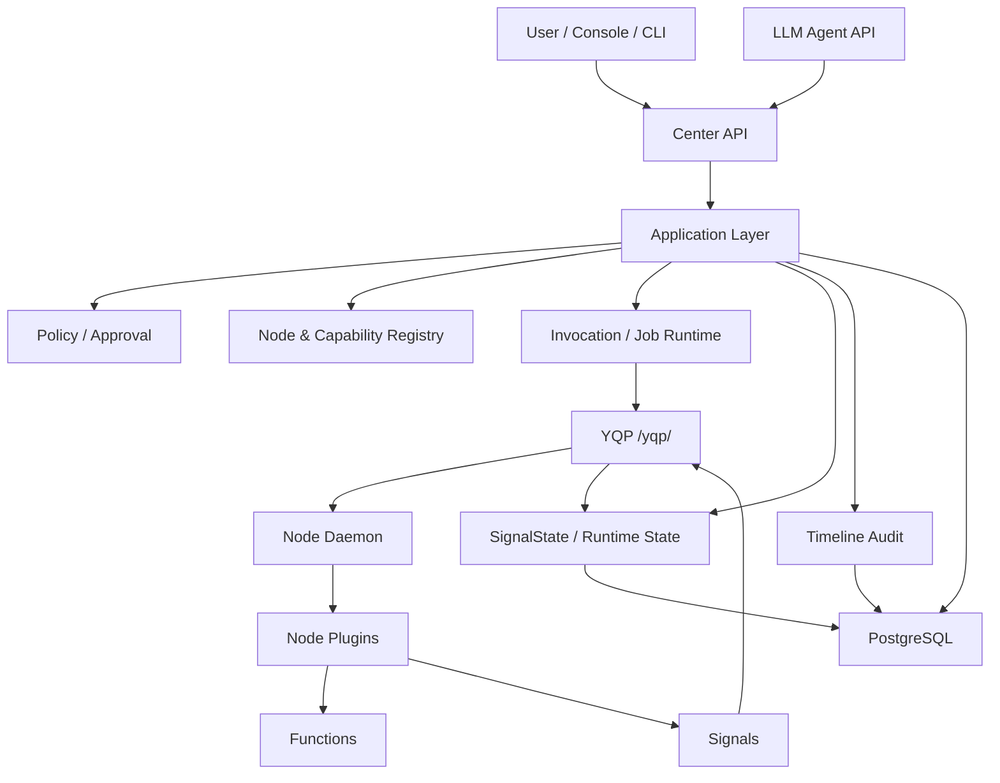

# YeQu Center 当前项目全貌与架构诊断

日期：2026-06-30
基于提交：`d46b244 fix: switch LLM retry from exponential backoff to 5x5s fixed intervals`
验证命令：

```bash
ruff check .
mypy src/
```

当前结果：

```text
历史记录：2026-06-28 时 `ruff check .` 已通过，`mypy src/` 仅剩
`jsonschema` stubs 相关非阻塞问题。本文档本次只做架构状态更新，未重新跑全量
`ruff` / `mypy`。
```

## 1. 结论摘要

YeQu Center 当前已经从早期的功能堆叠型原型，进入了一个具备清晰核心控制面的平台雏形。项目的主架构方向仍然符合最初设计：Center 作为统一控制中心，Node Daemon 作为设备侧执行面，Agent/Admin/Console/CLI 作为调用入口，所有实际设备能力执行都通过 Center 的策略、审批、Invocation、Job、Timeline 和 YQP 协议路径。

2026-06-30 架构判断：随着 WinNode + LinuxNode 稳定接入、Artifact 实际落地、croc 跨 Node 传输跑通，项目主线应从 “Center Capability Runtime v1” 升级为 “Center Execution Runtime v2”。新的主线不是替代 capability registry，而是在其之上增加 Execution Admission、Operation Bus、OperationEvent/Waiter、workflow handlers 和 Agent wait/resume。后续执行以 `docs/todos/2026-06-30-center-execution-runtime-v2.md` 为准。

当前项目已经比较成熟的部分包括：

- Node 预配置、认证、hello、heartbeat、capability 注册、signal 上报、job poll/accept/finish/renew/cancel/reconcile 主链路。
- Center 侧的 Invocation/Job 生命周期、Policy、Approval、Resource Lock、Timeline、SignalState、RuntimeInstance 等核心模型。
- Agent 通过 application 层执行工具调用，而不是直接绕过 Center 调度 Node。
- Agent 生产默认工具面已经收敛为 Center meta tools：`node.*`、
  `capability.*`、`artifact.*`，真实 Node 能力通过 Center registry 发现和调用。
- Artifact / Media / Blob 基础层已经进入日常使用路径：Node 可上传 artifact，
  Console 可浏览/下载/预览，Agent 可用 `artifact.present` 主动把媒体 artifact
  作为独立聊天内容呈现。
- Admin route 已从早期巨型文件拆分成多个领域路由。
- YQP message dedup 已持久化到数据库，支持跨进程和重启后的重复检测。
- `ruff check .` 与 `mypy src/` 当前均可作为有效质量门禁。
- 最新远端更新已修复长生命周期 Agent SSE 持有 DB session 的关键问题。

但项目还不能称为完全成熟的生产平台。主要不足集中在：

- 生产入口 `reload` 已修复为 `False`。
- 数据库层面的 `idle_in_transaction_session_timeout`、`statement_timeout`、`lock_timeout` 尚未在代码或部署规范中固化。
- Agent 默认不再一次性接收所有 raw Node capabilities，但未来能力数量继续增长后
  仍需要 Tool RAG / semantic retrieval 来治理候选工具集合。
- 多 Node fan-out/fan-in、跨节点聚合执行、调度策略仍是基础阶段。
- 长任务/复合任务的等待、取消、恢复和前端投影仍缺少统一 Operation Bus；当前 transfer、maintenance、approval、Agent stream 各自承担了一部分运行时语义。
- `agent_service.py`、`agent_stream.py`、`node_service.py`、`maintenance_executor.py` 仍是大模块，结构风险未完全消除。
- Maintenance executor 仍直接创建 Invocation/Job，和统一 application 执行入口的理想边界仍有差距。
- MCP adapter 尚未实现；当前核心协议仍是 YQP。

总体判断：

> 当前项目已经趋于完善，但尚处于“核心架构可用、生产可靠性继续硬化、规模化能力待建设”的阶段。

## 2. 当前总体架构



当前依赖方向的目标形态是：

```text
api/routes/*
  -> application/*
       -> services/*
            -> models/*
            -> protocol/*

agent/*
  -> application/*
  -> provider implementations
```

实际状态：

- `application/` 已存在，并承担工具执行、工具预检、Maintenance Plan 创建等用例边界。
- `services/` 没有反向依赖 `agent/`，有 import boundary 测试保护。
- `agent_service.py` / `agent_stream.py` 不再直接 import 关键 Center services 来创建 Job/Approval/Invocation。
- 但 Agent 层仍直接读取部分 `models`，例如 session、history、invocation/job 查询。这说明“执行控制面”已经解耦，但“会话/展示/历史读取”边界仍可继续收敛。

## 3. 核心领域对象

| 对象 | 当前职责 |
|---|---|
| Node | 可连接的执行环境。可表示 Windows、Linux、云主机、未来 OOB 设备等。 |
| RuntimeInstance | Node 内的平台无关运行上下文，用于区分不同 runtime。 |
| Capability | Node 插件注册的 Function 或 Signal 元数据。 |
| SignalState | Signal 的当前状态存储，包含 TTL、fresh/stale、quality、当前值。 |
| Invocation | Actor 发起的一次语义调用意图。 |
| Job | 派发到具体 Node 的实际执行任务。 |
| ApprovalRequest | L2 write/destructive 等需要人工确认的审批门禁。 |
| ResourceLock | 防止冲突资源被并发写入。 |
| TimelineEvent | 审计和追踪事件，使用全局递增序列。 |
| YqpMessage | YQP message_id 持久化去重记录。 |
| MaintenancePlan | 多步骤 check/repair/verify 维护计划。 |
| AgentTurn / AgentTurnEvent | Agent SSE 交互过程的持久化事件流。 |
| CapabilityDefinition / CapabilitySource | v2 能力注册表。Definition 表示语义能力，Source 表示某个 Node/plugin 的具体注册来源。 |
| Artifact / ArtifactBlob | Center 托管的文件、图片、报告、日志等二进制/媒体资产及其物理存储记录。 |
| Operation / OperationEvent | 目标 v2 模型。表示 Center 管理的可等待运行时过程和运行时事件流，用于长任务、复合任务、Agent wait/resume 和未来 MQ/outbox。当前尚未实现。 |

## 4. 能力边界

### 4.1 Center 的边界

Center 负责：

- Node/token 认证。
- Node registry 与 capability registry。
- Policy 与 execution mode 判定。
- ApprovalRequest 创建、审批、消费、过期扫描。
- Invocation/Job 创建和生命周期控制。
- ResourceLock 资源冲突控制。
- SignalState 当前状态与 stale 判断。
- Timeline 审计事件。
- YQP endpoint 与 Node 协议处理。
- Console/Admin/Agent API 的统一入口。

Center 不应该负责：

- 具体 Windows/Linux 本地操作细节。
- 插件内部业务实现。
- 绕过 Job 状态机直接修改 Job 终态。
- 让 Agent 或前端直接调用 Node。
- 在普通读接口中执行隐式写入。

### 4.2 Node / Daemon 的边界

Node/Daemon 负责：

- 持有本机插件和本地执行能力。
- 启动后 `node.hello`。
- 上报 capability manifest。
- 周期 heartbeat。
- 周期 signal.report。
- poll job、accept job、执行 job、finished 上报结果。
- lease renew、job.event、reconcile_jobs。

Node/Daemon 不负责：

- 全局调度。
- 策略审批。
- 跨 Node 冲突处理。
- Timeline 全局序列。
- 用户/Agent 权限判断。

### 4.3 Agent 的边界

Agent 当前负责：

- 接收 prompt。
- 调用 LLM provider。
- 生成 tool calls。
- 将 tool calls 转换为 Center application command。
- 消费执行结果并生成最终回答或 SSE event。

Agent 不应该负责：

- 直接调用 Node。
- 直接创建 Job/Approval/ResourceLock。
- 持有跨 LLM 调用、轮询、审批等待的 DB session。
- 把全部 capability 永久塞进上下文。

最新状态：

- `/agent/invoke/stream` 和 `/agent/plan/stream` 已在 route 层释放请求级 DB session。
- `agent_stream.py` 内部已改为多个短生命周期 `async_session_factory()` session block。
- 这解决了之前 SSE 流长时间持有 DB session 并产生 `idle in transaction` 的关键问题。

### 4.4 Console/Admin API 的边界

Console/Admin API 负责：

- 展示节点、能力、信号、任务、审批、timeline、maintenance 等状态。
- 触发 admin 级调用。
- 审批、拒绝、恢复维护计划。

Console/Admin API 不应该：

- 在读接口中触发状态刷新写库。
- 绕过 application service 创建 Job。
- 把业务编排堆在 route 中。

当前状态：

- Admin route 已拆分为 `admin_nodes.py`、`admin_activity.py`、`admin_approvals.py`、`admin_sessions.py`、`admin_provisioning.py`、`admin_invocations.py` 等。
- `/admin/nodes` 和 `/admin/signals` 已避免在读路径上写 SignalState。

## 5. 当前主要能力

### 5.1 YQP 协议能力

当前 `/yqp/` 单 POST endpoint 支持：

- `node.hello`
- `node.heartbeat`
- `node.register_capabilities`
- `signal.report`
- `job.poll`
- `job.accepted`
- `job.finished`
- `job.lease_renew`
- `job.event`
- `job.cancel`
- `node.reconcile_jobs`

已完成的可靠性增强：

- Bearer token 认证。
- node_id/token 绑定校验。
- timestamp skew 校验。
- DB-backed `YqpMessage` message dedup。
- empty poll 返回 `job.empty`，payload 保持 `{"jobs": []}`。
- YQP response envelope 包含 `node_id`。
- reconcile 时 Center terminal state 保持权威。
- YQP 阶段耗时日志可定位 parse/auth/dedup/handler 卡点。

尚未完成：

- WebSocket push delivery。
- YQP message dedup 历史记录的独立清理任务。
- 严格幂等 replay response fingerprint。目前重复 message_id 返回 409。
- `node_service.py` 仍是 YQP handler 聚合大文件。

### 5.2 Job / Invocation / Resource Lock

当前主路径：

```mermaid
sequenceDiagram
    participant Actor
    participant App as Application Service
    participant Policy
    participant DB
    participant Node

    Actor->>App: ExecuteToolCommand
    App->>Policy: check policy / L2 gate
    App->>DB: create Invocation
    App->>DB: create Job + ResourceLock
    Node->>DB: job.poll
    Node->>DB: job.accepted / running
    Node->>DB: job.finished
    App->>DB: collect terminal result
```

当前具备：

- Job 状态机。
- terminal state 不可变。
- timeout scanner。
- resource lock。
- wait_for_result 模式。
- node offline/unavailable 判断。

不足：

- 真正的多 Job fan-out/fan-in 聚合尚未形成通用 application 能力。
- 跨多个 Node 的并行任务聚合和局部失败语义仍需设计。

### 5.3 Agent 能力

当前具备：

- Fake provider 与 DeepSeek provider。
- 非流式 invoke。
- SSE invoke/plan。
- 标准 ReAct 终止：Provider 输出最终 assistant text 且不再发 tool call 即结束。
- Agent 不再合成 fallback 回复；Provider 未返回最终文本或工具调用时暴露 `agent_protocol_error`。
- SSE 与 AgentTurn metadata 会记录 `agent.prompt_context`，用于前端调试系统提示词和可用工具上下文。
- ToolPreflightApplicationService 做执行前能力/策略检查。
- ToolInvocationApplicationService 做真实执行。
- AgentTurn / AgentTurnEvent 持久化 SSE 事件。
- provider timeout/retry 基础能力。DeepSeek 当前使用固定 5 次、每次间隔 5 秒的
  retry 策略，避免指数退避导致用户等待过长。
- Center meta tools：
  - `node.list`
  - `node.status`
  - `capability.search`
  - `capability.describe`
  - `capability.invoke`
  - `artifact.list`
  - `artifact.get`
  - `artifact.present`

最新修复：

- Agent SSE 不再持有 route-level DB session。
- Agent stream 内部 DB 操作被拆成短事务块，避免跨 LLM 调用、job polling、审批等待持有连接。
- `task_completed` 元工具与 fallback synthesis 已移除。
- 用户消息在 Console 中会先以 optimistic user block 显示，再由服务端
  `agent.prompt.received` 事件确认并替换，避免重复气泡。
- `artifact.present` 会渲染为独立 artifact presentation block，而不是被埋在
  tool call 的 Result 面板里。

不足：

- 当前已具备 Center meta-tool discovery/invoke，但尚未实现真正的 Tool RAG /
  semantic retrieval。能力数量继续增长后，需要从“固定 meta tools + registry
  search”升级为检索式候选能力上下文。
- `agent_service.py` 与 `agent_stream.py` 仍然非常大，非流式与流式路径仍有逻辑重复。
- Agent 仍直接读取部分 models，边界可继续收敛为 application query service。

### 5.4 Signal / State Store

当前具备：

- `SignalState` 当前状态表。
- signal.report 成功后更新当前状态。
- Admin 查询 signal 状态。
- Node summary/detail 包含 fresh/stale signal count。
- SignalStateScanner 主动标记 stale 并写 timeline。
- Admin 读路径中使用内存计算 effective freshness，避免读接口写库。

不足：

- Signal 对 Node degraded 的影响仍偏基础。
- SignalState 还没有形成面向 Agent 的稳定查询/摘要能力。
- 大量 Signal 后的聚合、降采样、告警规则还未设计。

### 5.5 Maintenance 能力

当前具备：

- check/repair/verify 多步骤计划。
- step condition。
- artifacts。
- rollback hint。
- requires_approval 写步骤门禁。
- pending approval 创建。
- resume/reject 入口。
- 部分 failure injection 测试能力。

不足：

- `maintenance_executor.py` 仍直接 import `create_invocation` / `create_job`，没有完全复用 `ToolInvocationApplicationService`。
- executor 文件规模仍大，流程复杂，端到端场景还应补强。
- partial failure、rollback recommended、approval resume/reject 的组合矩阵仍需要更多测试。

## 6. 生产可靠性现状

### 6.1 已修复或缓解

近期已处理的问题：

- DB pool 参数已配置化并扩大默认值。
- Admin signal refresh 写路径已移出读接口。
- node.hello 的 timeline 写入已通过 TimelineWriter 异步队列处理，避免阻塞 bootstrap。
- YQP handler 增加阶段耗时日志。
- Agent SSE 长 session 持有 DB session 的问题已修复。
- Center startup 增加孤儿 DB session 清理路径，用于降低重启后锁级联风险。
- YQP message cleanup 已从请求热路径迁出，降低多 Node 高频 poll/heartbeat 下的
  DELETE 锁竞争。
- 质量门禁已经大幅收敛；具体全量 `ruff` / `mypy` 结果以最新 CI 或本地验证为准。

### 6.2 仍未闭环

仍存在的生产风险：

1. ~~`src/yequ/main.py` 仍硬编码 `reload=True`~~ 已修复：`reload=False`。

2. PostgreSQL 层面的安全网仍应作为部署要求固化
   建议在数据库或部署脚本中明确：

   ```sql
   ALTER DATABASE yequ SET idle_in_transaction_session_timeout = '2min';
   ALTER DATABASE yequ SET statement_timeout = '120s';
   ALTER DATABASE yequ SET lock_timeout = '5s';
   ```

   具体值需要结合实际任务耗时再调优。

3. Timeline 全局序列仍是潜在高竞争资源
   TimelineWriter 已缓解一部分，但所有同步 `add_timeline_event` 调用仍需要继续审查，尤其是 YQP handler、scanner、token auth、liveness 等路径。

4. 默认 token bootstrap 存在生产安全风险
   `api/app.py` 在没有 token 时会创建默认 `qq756522327` admin/agent token。生产环境应改成显式初始化或部署时注入，不应保留固定默认口令。

## 7. 与最初设计的符合度

| 设计目标 | 当前状态 | 判断 |
|---|---|---|
| Center 作为统一控制面 | 已实现 | 符合 |
| Node 平台无关 | 基本实现 | 符合，但 WinNode 能力扩展后需继续验证 |
| Agent 不直接访问 Node | 已实现 | 符合 |
| Invocation -> Job 标准路径 | 已实现 | 符合 |
| Timeline 审计 | 已实现 | 符合，但锁竞争需继续硬化 |
| Signal 当前状态 | 已实现 | 比早期完善 |
| 多 Node fan-out/fan-in | 部分基础 | 未完全实现 |
| 完整 reconnect/reconcile | 部分实现 | 仍需增强 |
| WebSocket push | 未实现 | 后续能力 |
| MCP adapter | 未实现 | 后续能力 |
| 大规模 capability 上下文管理 | 部分实现 | 已通过 Center meta tools 降低 prompt 暴露面，Tool RAG 尚未实现 |

## 8. 主要不足清单

### P0：生产可靠性

- ~~生产关闭 `reload=True`。~~ 已修复。
- 固化 PostgreSQL timeout 安全网。
- 对所有长生命周期请求检查 DB session 边界。
- 审查同步 timeline 写入路径。
- 移除或限制默认 admin/agent token bootstrap。

### P1：规模化能力

- `capability.search` / `capability.describe` / `capability.invoke` 已进入正常路径。
- `artifact.list` / `artifact.get` / `artifact.present` 已让 Agent 能主动呈现 Center
  托管媒体。
- Center 已维护 Definition/Source capability index，支持按 node、platform、risk、
  effect 等结构化条件筛选。
- 下一步是 Tool RAG / semantic retrieval：当 capability 数量继续增长时，从
  registry 中检索少量候选能力，而不是把大量能力描述塞进 prompt。

### P1：多 Node 调度

- 统一 fan-out/fan-in execution model。
- 定义跨 Node 部分成功、失败、timeout、cancel 语义。
- 增加多 Node 聚合 timeline 视图。
- 增加多 Node 并发测试。

### P1：模块拆分

- 拆分 `node_service.py`：
  - lifecycle
  - capabilities
  - signals
  - jobs
  - reconcile
- 拆分 `agent_service.py` / `agent_stream.py` 的共享 runtime core。
- 拆分 `maintenance_executor.py` 的 step planning、approval、job execution、artifact、finalize。

### P2：协议与生态

- MCP adapter：把 Center capabilities 暴露成 MCP tools，但执行仍复用 Center policy/job/timeline。
- YQP WebSocket push。
- YQP replay response fingerprint。
- Signal 告警规则与状态摘要。
- Console/Agent SSE contract 测试继续补强。

## 9. 推荐下一步路线

建议下一阶段不要优先新增大量 WinNode 能力，而是先完成扩展前的基础硬化：

1. 生产运行安全：
   - `reload` 配置化，默认生产关闭。
   - DB timeout 配置进入部署文档或自动迁移/启动检查。
   - 默认 token bootstrap 改为显式安全初始化。

2. Capability 上下文治理：
   - 保持当前 Center meta tools 作为默认 Agent 工具面。
   - 为 `capability.search` 增加 semantic retrieval / Tool RAG。
   - 为 capability manifest 补齐 tags、examples、artifact input/output、
     runtime constraints 等检索字段。

3. YQP/Node service 拆分：
   - 保持 URL 和协议不变。
   - 先移动 handler 到子模块，再补 DTO。

4. 多 Node 执行模型：
   - 定义 fan-out/fan-in schema。
   - 先实现只读检查类能力的多 Node 聚合。
   - 再扩展到维护/写操作。

5. Maintenance 执行统一化：
   - 将 executor 的 Job 创建改为复用 `ToolInvocationApplicationService` 或一个专门的 application execution core。
   - 增加 approval/rollback/partial failure 端到端测试矩阵。

## 10. 当前成熟度判断

| 维度 | 当前成熟度 |
|---|---|
| 核心架构方向 | 高 |
| 单 Node 执行闭环 | 高 |
| Agent/Center 解耦 | 中高 |
| YQP REST 协议 | 中高 |
| 生产可靠性 | 中 |
| 多 Node 调度 | 中低 |
| Capability 规模化 | 低 |
| Maintenance 完整性 | 中 |
| 代码质量门禁 | 高 |
| 模块可维护性 | 中 |

最终判断：

> YeQu Center 已经具备成为个人基础设施控制中心的主体结构和核心闭环。当前不是需要推倒重写的状态，而是需要在生产可靠性、能力发现、多 Node 调度和大模块拆分上继续推进。只要下一阶段先补齐这些基础设施，再扩展 WinNode 和更多插件能力，项目可以比较自然地走向长期可维护的平台形态。
