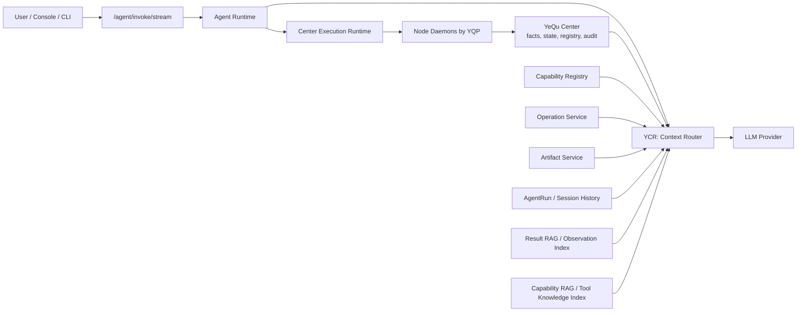
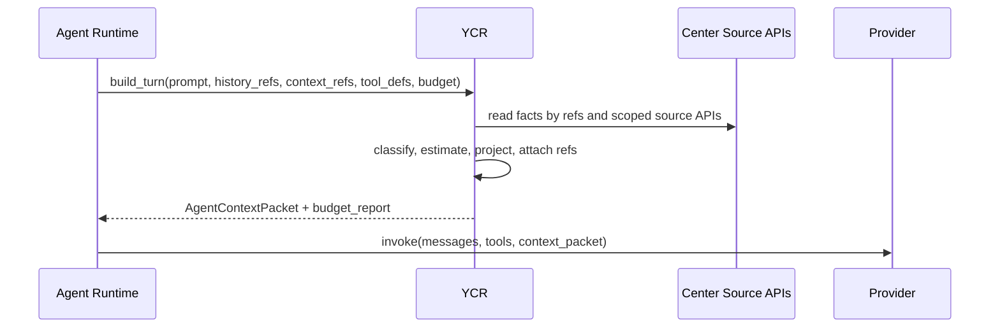
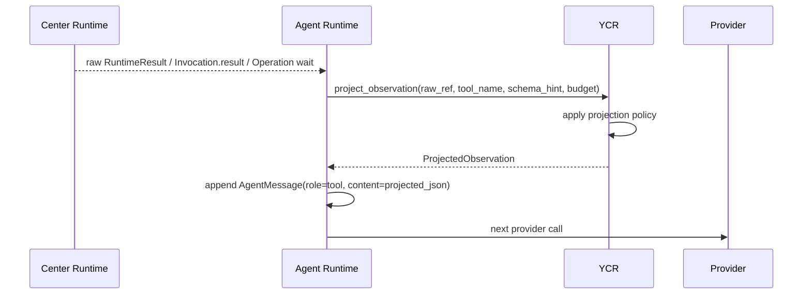
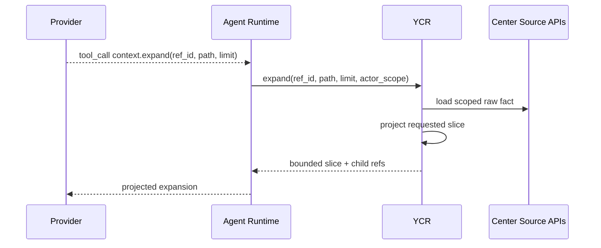

# YeQu Context Router 详细设计提案

状态：target design, partially implemented  
日期：2026-07-04  
适用阶段：进入下一阶段前的 Agent 上下文预算与工具输出治理  
简称：YCR

实现基线和验收状态已经重新校准：

1. YCR 代码归属 `src/yequ/ycr/`，不再放在 `src/yequ/agent/` 下。
2. `src/yequ/ycr_app.py` 是独立 YCR 服务入口；Center 和 Agent 只能通过 `YcrClient` 边界访问 YCR。
3. `YEQU_YCR_BACKEND=http` 是唯一运行形态；Center/Agent 不再拥有 embedded YCR backend。
4. Provider 输入前必须使用确定性 projection，禁止 raw tool result 直接进入下一轮 LLM 输入。
5. `ycr_context_refs` 与 `ycr_context_chunks` 是持久 ref 与检索 chunk 的事实表。
6. `context.*` meta tools 读取持久 ref/chunk，不依赖进程内缓存。
7. Provider 层只接受已经投影的 tool observation；未投影内容触发 `unprojected_tool_observation`，不做 raw fallback。
8. 当前实现由 `src/yequ/ycr/capability_gateway.py` 负责 capability discovery：无 query 时走 registry filter；有 query 时走 Tool RAG hybrid retrieval。
9. Tool RAG 使用本地 OpenAI-compatible embedding endpoint，推荐 `scripts/start-ycr-embedder.sh` 启动 CPU 版 `BAAI/bge-m3`；测试通过 pytest monkeypatch 注入测试向量函数，不提供部署可选的替代 embedding provider。
10. 当前实现仍未通过本文最终验收；`AgentContextPacket` 主路径、UI/debug 双轨治理、ref durable anchor 和完整 ledger 仍是必须完成项。

硬验收补充：

1. YCR 接入后，YCR 加入前可以完成的 Agent 行为不得退化。直接可调用能力不能被迫退化成无休止 `capability.search` / `capability.describe` / `context.expand` 循环。
2. RAG/检索只能作为缺失、歧义、大结果展开和语义增强路径，不能替代 Center registry 的确定事实，也不能改变 capability invoke 的标准合同。

本文定义 YeQu Context Router（YCR）的目标形态、边界、接口和落地路线。YCR 是 Agent 与所有信源之间的独立上下文代理。它不替代 Center 的注册、调度、审计和状态存储，也不让 Agent 绕过 Center 调用 Node。它只负责一件事：把来自 Center、Node capability、Operation、Artifact、AgentRun history 和未来检索索引的信息，转换成可预算、可追溯、可扩展、不会污染 LLM 上下文的 Agent 输入。

## 1. 当前事实

当前主路径是 `/agent/invoke/stream`。Agent 通过 Center 标准路径执行 capability，不直连 Node。Node capability 注册后进入 capability registry，再通过 meta tools 被 Agent 搜索、描述和调用。

当前上下文和 token 激增的直接链路如下：

1. `src/yequ/agent/tool_stream.py` 在工具成功时把完整结果写入 `agent.tool_call.completed` 的 `result` 字段。inline meta tool 使用 `result.output_data`，Node job 使用 `invocation.result`。
2. `src/yequ/agent/runtime_state.py` 的 `AgentToolObservationCollector.record_event()` 把 completed event 的 `data["result"]` 原样保存为 tool observation。
3. `src/yequ/agent/agent_stream.py` 在下一轮 ReAct 输入前执行 `history.append(AgentMessage(role="tool", content=json.dumps(tc_result)))`，因此完整 tool result 会进入下一次 provider 调用。
4. `src/yequ/agent/provider.py` 的 `sanitize_tool_payload_for_agent()` 只递归移除 `approval_id`、`dry_run` 和 `approval_enforced` 等内部字段，不做预算、投影、摘要或引用化。
5. `src/yequ/agent/deepseek_provider.py` 的 `_sanitize_tool_observation_content()` 只调用上述 sanitizer，不限制 tool observation 大小。

因此，当前 token 主要浪费点不是模型本身，也不是单一 meta tool，而是“任意信源输出都会沿默认路径原样进入 Agent history”的系统性缺口。

当前高风险信源包括：

| 信源 | 当前行为 | 风险 |
|---|---|---|
| `node.list` | `src/yequ/runtime/meta_tools.py` 直接返回 `node_list()`。 | 多 Node 时会连带大量 runtime 和 capability source 信息。 |
| `node.status` | 直接返回 `node_status()`，其中包含 `capability_sources`。 | 单个 Node 能力多时输出膨胀。 |
| `capability.describe` | 默认 `projection="detail"`。 | schema、sources、examples、diagnostics 可一次性进入上下文。 |
| `operation.status` | 直接返回完整 Operation 投影。 | 长任务、transfer、maintenance 会积累大量事件和 domain projection。 |
| `transfer.status` | 直接返回完整 transfer domain projection。 | progress、source/target task、错误细节和 ledger 字段会随传输生命周期增长。 |
| `context_refs` | `src/yequ/api/agent_context.py` 把 `OperationService.status()` 的结果 json.dumps 到 prompt。 | 继续/恢复长任务时会再次注入完整 Operation observation。 |
| `AgentRun resume` | `_agent_run_resume_prompt()` 把 run projection 和 operation observation 完整写入 prompt。 | history 与 operation 状态重复进入上下文。 |
| Node capability output | Node 可返回任意 JSON。 | 文件列表、日志、诊断、扫描结果、命令输出等天然不可控。 |

当前已有的 capability structured discovery 是正确方向，但它只治理“找工具”和“描述工具”的一部分，不治理“工具执行结果如何进入 Agent”。YCR 要补齐后者。

## 2. 设计目标

YCR 的设计目标是确定的：

1. Agent 永远不直接消费 raw tool result、raw operation status、raw artifact metadata 列表、raw capability detail 或 raw history block。
2. 所有进入 provider 的非用户输入信息必须先经过 YCR，得到带预算、带来源、带 refs、带截断说明的 context packet。
3. Center 继续拥有事实、调度、状态机、审计、权限、Operation、Artifact 和 capability registry；YCR 不写业务事实，不执行 Node job。
4. YCR 是独立中间构件。它在架构上位于 Agent Runtime/Provider 前方，作为所有信源的正向代理，而不是继续把上下文治理逻辑塞进 Center 的 application service。
5. YCR 对信息压缩必须可追溯。压缩后的摘要不是事实源；事实源仍在 Center，YCR 输出中的 `refs` 必须能让 Agent 按需查看、搜索、展开或 tail。
6. YCR 不允许静默 fallback 到 raw 输出。YCR 不可用或投影失败时，Agent 调用失败并给出稳定错误码，而不是把未经治理的原始 JSON 继续塞给 LLM。
7. YCR 必须为未来 Tool RAG 和 Result RAG 留出位置，但第一阶段不依赖向量库或 LLM 摘要才能工作。

## 3. 非目标

YCR 第一阶段不做以下事情：

1. 不替代 YQP、Node Daemon、capability manifest 或 `docs/node-capability-contract.md`。
2. 不替代 `ExecutionGuard`、`PolicyEngine`、`ExecutionAdmissionService` 或 `CenterExecutionRuntime`。
3. 不改变 Agent 只能通过 Center 标准路径执行 capability 的规则。
4. 不把 Node capability 的 output schema 变成可选项。Node capability 仍必须给出稳定 output schema。
5. 不用 LLM 摘要作为唯一事实。LLM 摘要只可作为展示或检索辅助，不能覆盖 Center 原始记录。
6. 不把所有工具都做成向量检索。结构化、可确定裁剪的输出优先用确定性 projection；语义检索用于长文本、日志、列表、历史和能力说明。

## 4. 架构位置

YCR 位于 Agent 与所有信源之间。



关键边界：

| 构件 | 拥有职责 | 不拥有职责 |
|---|---|---|
| Center | 认证、策略、调度、状态、审计、Operation、Transfer、Artifact、capability registry。 | 不负责把所有信源都加工成 LLM 预算内上下文。 |
| Agent Runtime | ReAct loop、provider 调用、tool call 顺序、AgentRun checkpoint、SSE 事件。 | 不直接裁剪任意信源，不维护检索索引。 |
| YCR | 信源投影、预算控制、引用化、检索入口、上下文包构建、上下文账本。 | 不执行工具，不审批，不调度 Node，不拥有业务事实。 |
| Node | 执行本地 capability，上报 progress/result/artifact。 | 不判断 Agent 该看多少输出，不实现 LLM 上下文策略。 |

实现形态上，YCR 必须按独立服务设计。开发初期在同一仓库内提供 client 和测试替身；业务代码必须通过 `YcrClient` 接口调用它，不能在 Agent route 中直接调用 projection 函数并形成新的大模块。

## 5. 总体数据流

### 5.1 Provider 输入构建



Agent Runtime 不再自行拼接完整 `context_refs`、完整 resume checkpoint 或完整 tool history。它把“需要哪些上下文”传给 YCR，由 YCR 返回 provider-ready messages。

### 5.2 工具结果写回 Agent



`AgentMessage(role="tool")` 的内容必须是 `ProjectedObservation`，不能再是完整 `tc_result`。

### 5.3 Agent 按需展开信息



这保证 Agent 能继续完成任务，但每次只取它明确需要的切片。

## 6. 核心对象

### 6.1 AgentContextPacket

YCR 给 Agent Runtime 的 provider-ready 上下文包：

```json
{
  "packet_id": "ctxpkt_xxx",
  "session_id": "sess_xxx",
  "actor_id": "actor_xxx",
  "budget": {
    "max_input_tokens": 24000,
    "estimated_input_tokens": 11800,
    "reserved_response_tokens": 4000
  },
  "messages": [],
  "tool_definitions": [],
  "context_blocks": [],
  "refs": [],
  "budget_report": {
    "dropped_blocks": [],
    "projected_blocks": [],
    "truncated_paths": []
  }
}
```

`messages` 和 `tool_definitions` 是 provider-ready 数据。Agent Runtime 继续调用 provider，但不能绕过 packet 自行把 raw block 注入 prompt。

### 6.2 ProjectedObservation

每个 tool result、operation status、artifact list、Node status 都被转成：

```json
{
  "kind": "tool_observation",
  "name": "node.status",
  "call_id": "call_xxx",
  "status": "succeeded",
  "summary": "linux-node-01 is online; 42 function sources; 6 signals.",
  "facts": {},
  "refs": [],
  "omitted": [],
  "truncated": false,
  "budget": {
    "estimated_tokens": 420,
    "max_tokens": 1200
  }
}
```

`facts` 只放当前任务下一步决策需要的稳定字段。大列表、日志、schema、完整 source、完整 event stream 进入 refs。

### 6.3 ContextRef

YCR 输出中的引用对象：

```json
{
  "ref_id": "ctxref_xxx",
  "ref_type": "operation_status",
  "source": {
    "owner": "center",
    "id": "op_xxx",
    "path": "$.events"
  },
  "scope": {
    "actor_id": "actor_xxx",
    "session_id": "sess_xxx"
  },
  "available_ops": ["inspect", "search", "expand", "tail", "schema"],
  "expires_at": "2026-07-04T18:00:00Z",
  "summary": "Full operation event list omitted; use context.tail for recent events."
}
```

引用必须携带 actor/session scope。Agent 不能用一个 session 的 ref 读取另一个 session 或 actor 的上下文。

### 6.4 ContextLedger

YCR 必须写上下文账本，便于复盘 token 消耗和定位过度压缩：

```json
{
  "ledger_id": "ctxled_xxx",
  "packet_id": "ctxpkt_xxx",
  "source_kind": "tool_result",
  "source_id": "job_xxx",
  "raw_size_bytes": 182034,
  "projected_size_bytes": 3210,
  "raw_estimated_tokens": 45508,
  "projected_estimated_tokens": 803,
  "projection_policy": "node_status_summary_v1",
  "refs_created": ["ctxref_xxx"],
  "truncated_paths": ["$.capability_sources"]
}
```

账本用于调试和质量门禁，不进入 provider prompt。

## 7. YCR 内部模块

YCR 服务由以下模块组成：

| 模块 | 职责 |
|---|---|
| `SourceAdapter` | 读取 Center 内部 source API、AgentRun history、Operation、Artifact、capability registry 和未来索引。 |
| `SourceClassifier` | 识别输入类型：tool result、node status、capability detail、operation、transfer、artifact、history、log、file list、generic JSON。 |
| `BudgetEstimator` | 估算字符、JSON 字段、数组长度和 token 成本。第一阶段使用确定性近似，后续可接入 tokenizer。 |
| `ProjectionRegistry` | 按 `source_kind + tool_name + output_schema + requested_mode` 选择投影策略。 |
| `RefManager` | 创建、校验、过期和展开 `ContextRef`。 |
| `ContextPacketBuilder` | 组装 provider-ready messages、tool definitions、context blocks 和 budget report。 |
| `RetrievalGateway` | 暴露 `context.inspect/search/expand/tail/schema`，后续接 Result RAG。 |
| `CapabilityKnowledgeGateway` | 无 query 时暴露 registry-backed discovery；有 query 时使用 capability index + 本地 embedding 做 Tool RAG。 |
| `ContextLedgerWriter` | 写上下文账本、预算报告、投影策略命中记录。 |

这些模块在 YCR 内部形成清晰边界。Agent Runtime 只能依赖 `YcrClient`，不能依赖 `ProjectionRegistry` 等内部类。

## 8. 投影策略

YCR 必须按信源选择确定性 projection。默认 projection 是“最小可决策事实 + refs”，不是“截断前 N 字符”。

| 信源 | 默认投影 | 必须引用化的内容 |
|---|---|---|
| `node.list` | node_id、display_name、online 状态、runtime 总数、function/signal 数、关键 unavailable reason 计数。 | 每个 Node 的完整 `capability_sources`。 |
| `node.status` | node 基本状态、runtime 摘要、capability 分组计数、阻断性 contract issues。 | 完整 source 列表、每个 source 的 schema/preconditions/diagnostics。 |
| `capability.search` | 保持 summary，强制 limit 上限，输出匹配原因和 dispatchable source 数。 | schema、examples、所有 source detail。 |
| `capability.describe` | 默认 `invoke_ready`，只包含调用所需 input schema、risk/effect、可用 source、必要 preconditions。 | diagnostics、examples、完整 output schema、所有 source detail。 |
| `operation.status` | operation_id、kind、status、title、progress、last_error、next_action、recent event tail。 | 完整 event list、domain projection、关联 jobs、transfer ledger。 |
| `transfer.status` | transfer_id、status、source/target node、文件名、progress、rate、eta、resume_mode、失败原因、下一步动作。 | source/target task 全量输出、ledger、历史 progress stream。 |
| `artifact.list` | artifact_id、filename、type、size、created_at、node_id、preview availability。 | metadata 大字段、manifest、preview 原文。 |
| `artifact.get` | 元数据摘要和可展示 preview ref。 | 文件内容、binary bytes、大 preview。 |
| generic Node result | status、stable fields、error_code/message、artifact refs、stdout/stderr tail。 | stdout/stderr 全量、文件列表全量、扫描全量结果。 |
| Agent history | 最近必要轮次原样保留，较旧轮次用 run summary + refs。 | 旧 tool observations、旧 provider raw output。 |
| context_refs | 只注入 operation/transfer 的当前决策摘要。 | 完整 operation observation、完整 resume checkpoint。 |

YCR 输出必须显式记录 `omitted` 和 `refs`。Agent 看到的不是“信息消失”，而是“信息已被收起，需要时用 context 工具获取”。

## 9. 预算模型

第一阶段预算模型采用确定性估算：

1. JSON 字符数按 `ceil(chars / 4)` 估算 token。
2. CJK 文本按 `ceil(chars / 1.5)` 估算 token。
3. 每个 tool observation 有硬上限。
4. 每个 context block 有硬上限。
5. 整个 provider input 有硬上限，并预留 response tokens。
6. debug/SSE 的诊断字段有独立预算，不进入 provider 的内容不计入 LLM 输入预算，但必须被 ledger 记录。

默认预算：

| 项 | 默认上限 |
|---|---:|
| 单个 tool observation | 1,200 estimated tokens |
| 单个 operation context block | 1,500 estimated tokens |
| 单个 capability describe observation | 1,800 estimated tokens |
| 单个 generic Node result | 1,500 estimated tokens |
| provider input 中 history | 50% total input budget |
| provider input 中 current tool observations | 30% total input budget |
| provider input 中 capability/tool definitions | 20% total input budget |

超预算行为必须稳定：

1. 优先裁剪可通过 ref 恢复的大列表、大文本和重复字段。
2. 保留错误码、状态、下一步动作、用户路径、node_id、operation_id、transfer_id。
3. 生成 `truncated_paths` 和 `refs`。
4. 当最小可决策事实仍超过预算时，YCR 返回 `context_budget_exceeded`，Agent 失败并展示明确错误，不调用 provider。

## 10. Agent 可用的 context meta tools

YCR 引入一组 Agent meta tools，用于按需取回 refs。它们由 Center 暴露给 Agent，但执行目标是 YCR，不是 Node。

| Tool | 输入 | 输出 |
|---|---|---|
| `context.inspect` | `ref_id` | ref 摘要、可用操作、大小、schema hint。 |
| `context.expand` | `ref_id`, `path`, `limit` | 指定 JSON path 或字段的预算内切片。 |
| `context.search` | `ref_id`, `query`, `limit` | 在 ref 指向的大文本、列表、事件或结果中检索相关片段。 |
| `context.tail` | `ref_id`, `path`, `lines` | 日志、事件流、progress stream 的尾部。 |
| `context.schema` | `ref_id` | 大 JSON 的结构概要、字段路径和数组计数。 |

这些 meta tools 与现有 `capability.search` / `capability.describe` 分工不同：

| 工具族 | 解决问题 | 主要数据 |
|---|---|---|
| capability tools | 找能力、理解如何调用能力。 | capability registry、manifest、examples、source availability。 |
| context tools | 查看已经产生的大结果、大状态、大历史。 | tool result、operation、transfer、artifact、history、logs。 |

## 11. Tool RAG 的正确位置

本项目需要两个 RAG 位置，不能混成一个“大上下文 RAG”。

### 11.1 Capability RAG

Capability RAG 属于 capability discovery 层，服务于带 query 的 `capability.search` 和按需 `capability.describe`。它的输入是 capability manifest、agent_description、examples、tags、failure modes、preconditions 和平台/运行时特征。无 query 的 capability list/filter 不走 RAG，因为那是确定性的 registry 查询。

它解决：

1. 用户自然语言如何匹配 capability。
2. 多个 capability 功能相近时如何排序。
3. Agent 如何知道先调用哪个 preflight 或 describe。
4. 新 capability 注册后如何进入语义检索，而不改 Agent prompt。

Capability RAG 不解决已经执行完的工具结果过长问题。

### 11.2 Result RAG / Observation RAG

Result RAG 属于 YCR 的 RetrievalGateway，服务于 `context.search`、`context.expand`、`context.tail` 和 history compaction。它的输入是 tool observations、operation events、transfer progress、artifact previews、stdout/stderr、文件列表、扫描结果和历史对话。

它解决：

1. 工具输出很大时，Agent 如何只检索相关片段。
2. 长任务多次恢复时，Agent 如何查看关键事件而不重复注入全量 operation status。
3. Node capability 输出结构不可预测时，Agent 如何通过 schema/search 逐步定位信息。
4. 历史会话很长时，Agent 如何保留任务连续性。

当前项目的主要 token 问题来自 result -> agent 链路，因此第一阶段先落 YCR + Result RAG 接口；Capability RAG 作为第二阶段增强。

当前个人部署约束是 CPU-only，推荐模型为 `BAAI/bge-m3`。它支持多语言 dense/sparse/multi-vector 检索能力，但本项目第一版只使用 dense embedding + registry sparse/token signal；模型通过独立 `ycr-embedder` HTTP 服务加载，不进入 Center/YCR 主进程。5600GT + 32GB 内存适合本项目几十到几百个 capability 文档的低吞吐检索。

本地启动顺序：

```bash
pip install -e ".[embedder]"
export YEQU_EMBEDDER_MODEL=BAAI/bge-m3
export YEQU_EMBEDDER_DEVICE=cpu
export YEQU_EMBEDDER_USE_FP16=false
./scripts/start-ycr-embedder.sh 9820

export YEQU_YCR_EMBEDDING_PROVIDER=openai_compatible
export YEQU_YCR_EMBEDDING_MODEL=BAAI/bge-m3
export YEQU_YCR_EMBEDDING_BASE_URL=http://127.0.0.1:9820
./scripts/start-ycr.sh 9810
```

如果 `capability.search` 带 query 且 embedding endpoint 不可用，YCR 必须返回 `capability_rag_unavailable`，不能静默退回 registry 字段搜索。

## 12. 对当前代码的接入点

以下接入点必须修改，且修改方向确定：

| 文件 | 当前问题 | 修改方向 |
|---|---|---|
| `src/yequ/agent/tool_stream.py` | completed/waiting_operation event 中携带 raw result/output。 | 事件仍可保留 debug result 的受控 projection；provider history 只能使用 YCR `ProjectedObservation`。 |
| `src/yequ/agent/runtime_state.py` | `AgentToolObservationCollector` 原样保存 `data["result"]`。 | collector 保存 `ProjectedObservation`，并记录 `raw_ref` / `context_refs`。 |
| `src/yequ/agent/agent_stream.py` | `AgentMessage(role="tool", content=json.dumps(tc_result))` 原样进入 history。 | 写入 `json.dumps(projected_observation)`。 |
| `src/yequ/agent/provider.py` | sanitizer 只隐藏内部字段。 | 保留安全过滤，但预算和投影迁移到 YCR。provider 层只做最终防泄漏校验。 |
| `src/yequ/agent/deepseek_provider.py` | `_sanitize_tool_observation_content()` 不限制大小。 | 若收到非 YCR observation，返回 `unprojected_tool_observation` 错误，不静默裁剪。 |
| `src/yequ/api/agent_context.py` | context_refs 和 resume prompt 直接 json.dumps 完整 observation/checkpoint。 | 调用 YCR `build_turn` 或 `project_operation_context`，只注入 operation 摘要和 refs。 |
| `src/yequ/runtime/meta_tools.py` | `node.*`、`operation.status`、`transfer.status` 可返回大对象。 | meta tool 执行结果仍为事实输出，但写回 Agent 前必须经 YCR；同时调整默认 projection，降低原始结果尺寸。 |
| `src/yequ/services/capability_registry.py` | `node_status()` 包含完整 source，`capability.describe` 默认 detail。 | 增加 compact projection；`capability.describe` 的 Agent 默认改为 `invoke_ready`。detail 只能显式请求并经过 YCR。 |
| `docs/agent-sse-contract.md` | `agent.tool_call.completed` 声明 `result`，未区分 raw/projection。 | 后续合同更新为 `result` 是 UI/debug projection；provider observation 由 YCR packet 决定。 |

修改后，Center 继续把完整事实存入数据库和 timeline；但进入 Agent provider 的路径被 YCR 截断。

## 13. YCR 服务接口

YCR 对 Agent Runtime 暴露内部 HTTP/gRPC 接口。第一版 HTTP JSON 足够。

### 13.1 `POST /v1/context/build-turn`

用途：构建一次 provider 调用所需上下文。

输入：

```json
{
  "session_id": "sess_xxx",
  "actor_id": "actor_xxx",
  "provider": "deepseek",
  "model": "deepseek-chat",
  "user_prompt": "...",
  "history_refs": [],
  "context_refs": [],
  "available_functions": [],
  "budget": {
    "max_input_tokens": 24000,
    "reserved_response_tokens": 4000
  }
}
```

输出：`AgentContextPacket`。

### 13.2 `POST /v1/context/project-observation`

用途：把一次 tool result 投影成 provider 可消费 observation。

输入：

```json
{
  "session_id": "sess_xxx",
  "actor_id": "actor_xxx",
  "call_id": "call_xxx",
  "tool_name": "node.status",
  "status": "succeeded",
  "raw_source": {
    "kind": "runtime_result",
    "id": "job_xxx"
  },
  "raw_value": {},
  "schema_hint": {},
  "budget": {
    "max_tokens": 1200
  }
}
```

输出：`ProjectedObservation`。

### 13.3 `POST /v1/context/project-operation`

用途：把 operation/transfer/maintenance 的 status 投影成恢复上下文。

输入：

```json
{
  "session_id": "sess_xxx",
  "actor_id": "actor_xxx",
  "operation_id": "op_xxx",
  "mode": "resume"
}
```

输出：`ProjectedObservation` 或 `context_block`。

### 13.4 `POST /v1/context/expand`

用途：展开 ref 的某个路径。

输入：

```json
{
  "session_id": "sess_xxx",
  "actor_id": "actor_xxx",
  "ref_id": "ctxref_xxx",
  "path": "$.capability_sources",
  "limit": 20
}
```

输出：预算内切片、子 refs、截断说明。

### 13.5 `POST /v1/context/search`

用途：在 ref 指向的大对象中检索。

输入：

```json
{
  "session_id": "sess_xxx",
  "actor_id": "actor_xxx",
  "ref_id": "ctxref_xxx",
  "query": "permission denied",
  "limit": 5
}
```

输出：片段列表、路径、score、refs。

### 13.6 `GET /v1/context/ledger/{packet_id}`

用途：Console/debug 查看某次 turn 的上下文消耗。

输出：不进入 LLM 的预算和投影审计。

## 14. Center 需要提供的 source API

YCR 不直接访问业务数据库表。Center 提供受 scope 限制的内部只读 source API：

| API | 用途 |
|---|---|
| `GET /internal/source/operation/{operation_id}` | 获取 Operation 投影和可授权 ref。 |
| `GET /internal/source/transfer/{transfer_id}` | 获取 TransferSession 投影。 |
| `GET /internal/source/job/{job_id}/result` | 获取 Job/Invocation result。 |
| `GET /internal/source/artifact/{artifact_id}` | 获取 artifact metadata/preview。 |
| `GET /internal/source/capability/{capability_id}` | 获取 capability detail。 |
| `GET /internal/source/agent-run/{run_id}` | 获取 AgentRun checkpoint。 |
| `GET /internal/source/history/{session_id}` | 获取 session history。 |

这些 API 只读、受 actor/session 权限约束，并写内部 access audit。YCR 获取的是事实副本，不拥有事实生命周期。

## 15. 错误行为

YCR 必须延续项目“无静默 fallback”的原则。

| 场景 | 行为 |
|---|---|
| YCR 服务不可用 | Agent stream 返回 `agent.failed`，error_code=`context_router_unavailable`。不调用 provider，不注入 raw result。 |
| YCR 投影策略缺失 | 返回 `context_projection_unsupported`，包含 source_kind/tool_name/schema_hint。 |
| raw 对象最小事实仍超预算 | 返回 `context_budget_exceeded`，包含 raw_estimated_tokens、budget、可执行 ref 操作。 |
| ref 不存在或过期 | context tool 返回 `context_ref_not_found` 或 `context_ref_expired`。 |
| ref scope 不匹配 | 返回 `context_ref_forbidden`。 |
| search backend 不可用 | `context.search` 返回 `context_search_unavailable`；`context.expand` 和 `context.tail` 仍可工作。 |

YCR 不允许用“取前 4000 字符”作为通用 fallback。每个 fallback 都必须是显式错误或明确策略。

## 16. 安全和权限

YCR 的安全规则：

1. YCR 只接受 Center/Agent Runtime 的内部调用，不暴露给 Node。
2. 每个请求必须带 actor_id、session_id 和 internal service credential。
3. 每个 ContextRef 必须绑定 actor/session scope。
4. YCR 不返回 hidden fields：`approval_id`、`approval_enforced`、内部 token、Node secret、artifact download private token。
5. YCR 不改变 policy 决策，不绕过 approval。
6. YCR ledger 记录 raw size、projection policy 和 refs，不记录 secret 原文。

## 17. 与 SSE 和 Console 的关系

SSE 事件面向用户和调试，不等于 provider 输入。YCR 引入后需要明确双轨：

| 路径 | 内容 | 预算 |
|---|---|---|
| Provider input | YCR `AgentContextPacket` 和 `ProjectedObservation`。 | 强预算，超预算失败。 |
| SSE debug/UI | 受控 UI projection、OperationCard、Artifact preview、budget report 摘要。 | UI 预算，不能成为 provider raw 注入口。 |

`agent.tool_call.completed.result` 后续应定义为 UI/debug projection，而不是 raw result。完整结果通过 Console 的详情接口或 YCR ref 展开查看。

## 18. 与 capability 插拔性的关系

YCR 不破坏“新增 capability 后 Center/Agent 不改代码”的目标。规则如下：

1. 新 capability 按 manifest 注册，进入 capability registry。
2. Agent 通过 `capability.search` / `capability.describe` / `capability.invoke` 发现和调用。
3. capability 的 output schema 为 YCR 提供 schema_hint。
4. 当 capability 输出是标准类型时，YCR 使用已有 projection policy：
   - status/result object；
   - file list；
   - log/stdout/stderr；
   - artifact refs；
   - progress/event list；
   - table/list rows。
5. 当 capability 输出是未知大对象时，YCR 使用 generic JSON projection：顶层稳定字段 + schema概要 + refs。它不要求修改 Center 调度或 Agent prompt。
6. 只有当 capability 输出需要全新语义 projection，且 generic projection 不足以让 Agent 稳定完成任务时，才新增 YCR projection plugin；这不属于 Center 调度逻辑变更。

因此，YCR 是 capability 插拔性的补强，不是回到为每个 capability 写 Agent 分支。

## 19. 实施计划

### Phase 1：强制 provider 输入走 YCR

目标：立即解决 tool result、context_refs、resume prompt 的 raw 注入问题。

交付：

1. 新增独立 YCR client 接口和服务骨架。
2. `AgentToolObservationCollector` 保存 YCR `ProjectedObservation`。
3. `AgentMessage(role="tool")` 写入 projected JSON。
4. `context_refs` 和 resume prompt 改由 YCR 投影。
5. provider 层增加 guard：检测未投影的大 tool observation，返回显式错误。
6. 增加预算 ledger。
7. 增加测试：大 tool result 不进入 provider messages；YCR 不可用不 raw fallback。

### Phase 2：context tools 和 Result RAG 接口

目标：让 Agent 能按需取回 refs，而不是一次性注入。

交付：

1. 新增 `context.inspect`、`context.expand`、`context.tail`、`context.schema`。
2. 新增 `context.search` 的确定性 backend：JSON path/substring/事件字段检索。
3. 为日志、事件、文件列表和 transfer progress 建立分块索引。
4. Console 显示 YCR refs 和 budget report。

### Phase 3：Capability RAG

目标：让新增 capability 的发现更智能，但不改变 registry 合同。

交付：

1. 建立 capability knowledge index。
2. `capability.search` 支持真实 capability vector index + semantic ranking，并在响应中返回 retrieval trace。
3. `capability.describe` 默认 `invoke_ready`，detail/schema 走按需展开。
4. capability examples、aliases、failure modes 进入索引。

### Phase 4：独立部署和容量治理

目标：YCR 作为可独立水平扩展的中间服务。

交付：

1. YCR 独立进程配置、health、metrics。
2. Center internal source API 鉴权。
3. YCR cache、ledger retention、ref TTL。
4. token/size metrics 接入质量门禁。

## 20. 验收标准

YCR 设计落地后必须通过以下验收：

1. 构造一个 1MB tool result，provider messages 中不存在 raw 1MB 内容。
2. `node.list` 在 5 个 Node、每个 50 个 capability source 的情况下，provider observation 仍低于预算。
3. `capability.describe` 默认不再把 diagnostics/examples/所有 sources 全量注入 Agent。
4. Operation resume 不再把完整 `OperationService.status()` json.dumps 到 prompt。
5. `context.expand` 能按 ref 找回被收起的字段。
6. YCR 不可用时 Agent 明确失败，错误码为 `context_router_unavailable`，没有 raw fallback。
7. 每次 provider 调用都有 `AgentContextPacket.packet_id` 和 ledger，可查看 raw/projected size。
8. 新增一个未知 output schema 的 Node capability 后，不改 Center/Agent，也能通过 generic projection 防止上下文爆炸。

## 21. 设计复核后的硬约束

YCR 的实现必须同时满足以下硬约束。缺少任意一项时，不进入 Phase 1 开发完成状态。

### 21.1 Trust Zone

YCR 输出的每个 context block、tool observation、search snippet 和 file/log preview 必须标注信任级别：

| `trust_level` | 含义 |
|---|---|
| `trusted_center_fact` | Center 生成的状态、policy、operation、approval、transfer read model。 |
| `node_reported_fact` | Node 按 capability contract 上报的结构化事实。 |
| `untrusted_external_content` | stdout、stderr、日志、文件内容、网页内容、搜索片段、用户数据片段。 |

规则：

1. `untrusted_external_content` 永远不能被渲染为系统指令。
2. YCR 不能把 untrusted 文本改写成 trusted fact。
3. provider prompt 必须用固定边界包裹 untrusted snippet，并明确这些内容不是指令。

### 21.2 Result Ingestion Hard Cap

YCR 只治理进入 Agent 的上下文，不能替代 Center/YQP 的入库保护。Center/YQP 必须在 job result 入库和 SSE 发送前执行：

1. 单个 job result JSON 最大字节数；
2. 单个字符串字段最大字节数；
3. 单个数组元素数量上限；
4. 超限字段 artifact 化或拒绝并返回稳定错误；
5. tool result 中只保留 artifact ref、hash、row count、head/tail 和稳定摘要。

这条规则防止 raw result 不进入 LLM 但仍压垮 DB、内存或 SSE。

### 21.3 ModelBudgetProfile

YCR budget 必须由 provider/model profile 决定：

```json
{
  "provider": "deepseek",
  "model": "deepseek-chat",
  "context_window_tokens": 64000,
  "reserved_response_tokens": 4096,
  "tool_schema_budget_tokens": 8000,
  "history_budget_tokens": 20000,
  "observation_budget_tokens": 12000,
  "tokenizer_profile": "cjk_conservative_v1"
}
```

没有 profile 时，YCR 使用保守默认值，不使用模型宣传窗口作为硬预算。

### 21.4 Durable Source Anchor

`ContextRef` 必须区分短期 ref 和持久事实锚点：

| 字段 | 含义 |
|---|---|
| `ref_id` | YCR 生成的短期引用。 |
| `source_anchor` | 持久事实锚点，如 operation_id、transfer_id、job_id、artifact_id、run_id。 |
| `source_version` | source 的 updated_at、global_seq 或 content hash。 |

`ref_id` 过期后，只要 `source_anchor` 仍存在且权限通过，YCR 必须能重新生成 ref。长任务恢复不能依赖短期 ctxref 存活。

### 21.5 Projection Policy Version

每个 projection 和 ledger entry 必须记录：

1. `projection_policy`；
2. `projection_version`；
3. `raw_source_hash` 或 `source_version`；
4. `omitted_paths`；
5. `truncated_paths`；
6. `refs_created`。

这保证历史 AgentRun 可复盘，且投影策略升级不会破坏审计。

### 21.6 Tool Call 顺序保真

YCR projection 可以并发执行，但写回 provider history 时必须保持 provider 原始 tool call 顺序：

1. `tool_call_id` 不得改变；
2. observation 不得跨 call_id 合并；
3. `AgentToolObservationCollector` 必须继续以 provider call order 排序；
4. ledger 必须能按 call_id 查询每个 projection。

### 21.7 Source Read 事务边界

Agent 调用 YCR 时不得持有长事务等待 YCR。实现规则：

1. `project-observation` 优先把已拿到的 raw value 传给 YCR；
2. YCR 需要反查 source 时，通过只读 source adapter 使用短事务读取；
3. source adapter 必须有超时、分页和最大返回尺寸；
4. YCR source read 失败必须显式返回错误，不能 fallback 到 Agent raw input。

## 22. 最终结论

当前项目需要的不是单纯“把工具结果摘要一下”，也不是把 Tool RAG 硬塞进某个 meta tool，而是新增 YCR 作为 Agent 前方的独立上下文代理。

YCR 的核心价值是把信源事实和 Agent 上下文彻底解耦：

1. Center 继续稳定拥有事实和调度。
2. Node 继续按协议注册和执行 capability。
3. Agent 只看预算内、可决策、可追溯的 projection。
4. 大信息通过 refs 和 context tools 按需获取。
5. Capability RAG 服务于找工具，Result RAG 服务于看结果，两者由 YCR 统一路由但不混淆。

这套设计符合当前 Center-Nodes 架构，也符合后续“新增 Node / 新增 capability 不改 Center 和 Agent 行为”的目标。它作为 P1 Agent 上下文预算治理的正式实现方案进入下一轮开发。
