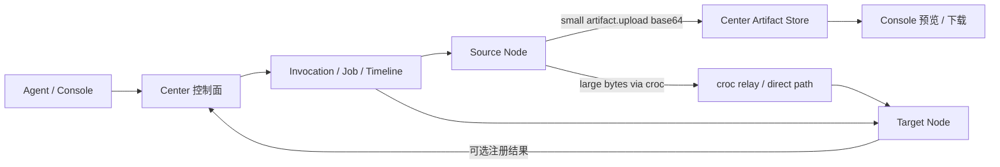

# Artifact 传输策略待办

状态：活跃待办
日期：2026-06-29
目标：在现有 Artifact 基础层上，建立轻量 artifact 上传与大文件/跨 Node 传输并存的数据面方案。

## 1. 当前确切实现

### 1.1 Center

Center 已经实现 `Artifact` / `ArtifactBlob` 本地存储：

- `artifact.upload` 走统一 `/yqp/` endpoint。
- Node 使用 Bearer token 认证。
- 请求 payload 中携带 `data_base64`。
- Center 一次性 base64 decode 成 bytes。
- `ArtifactService.create_artifact()` 计算 sha256、写入本地磁盘、创建 DB metadata。
- Admin / Console 通过 `/admin/artifacts/{artifact_id}/download` 下载。
- 默认大小限制是 `YEQU_ARTIFACT_MAX_UPLOAD_BYTES = 50 MiB`。

这条链路是：

```text
Node
  -> public ingress / nginx
  -> tunnel
  -> Center /yqp/ artifact.upload
  -> Center 本地 artifact store
```

因此它会占用公网入口服务器、反代、隧道和 Center HTTP 服务链路的带宽与请求资源。它没有分片、断点续传或流式上传。

### 1.2 WinNode

WinNode 已经实现：

- `windows.file.upload_artifact` capability；
- 截图、目录归档等能力可通过 `__artifact_uploads` 请求 daemon 上传产物；
- daemon 使用 `Path.read_bytes()` 一次性读取整个文件；
- daemon 将 bytes base64 后放入 YQP `artifact.upload` payload；
- 测试已经明确覆盖“YQP base64 payload”模式。

这说明当前方案是可用的轻量 artifact 通道，不是大文件传输通道。

### 1.3 已知边界

当前实现适合：

- 截图；
- 小图片；
- 小日志；
- 小型 JSON / 文本报告；
- 小型压缩包；
- Agent 对话中需要展示或下载的轻量产物。

当前实现不适合：

- 大文件；
- 大目录；
- 不稳定网络下的长时间传输；
- 需要断点续传的传输；
- WinNode 和 LinuxNode 之间互传大文件；
- 绕开公网入口服务器带宽瓶颈。

## 2. 最终策略

Artifact 继续作为统一资产层。传输通道分成两类。

### 2.1 策略 A：YQP Artifact Upload

用途：轻量产物进入 Center。

```text
Node -> Center artifact store
```

使用场景：

- 截图；
- 摄像头照片；
- 小日志；
- 命令输出附件；
- 小文件上传；
- Agent 对话中即时展示的媒体。

规则：

- 保留现有 `artifact.upload`。
- 默认建议软阈值为 10 MiB。
- 硬限制继续使用 `YEQU_ARTIFACT_MAX_UPLOAD_BYTES`。
- 不在这条链路上补断点续传。
- 不把大文件 base64 塞进 Agent 上下文或 Job output。

### 2.2 策略 B：croc Transfer

用途：大文件、目录、跨 Node、弱网传输。

`croc` 的公开能力与本项目需求匹配：跨 Windows/Linux/macOS，使用 relay，端到端加密，支持多文件与中断恢复，不要求本地开端口或做端口转发。

`croc` 是 Node 侧运行时依赖，不是 Center 的内置能力。Center 仓库可以随附 release 包以方便部署，但 Center 不能因为仓库里有包就假设某个 Node 已具备传输能力。每个 Node 必须通过 `*.transfer.croc.status` 探测自己的本地事实，然后由 Center 基于该事实进行调度。

当前仓库随附 release：

```text
third_party/croc/v10.4.4/
  croc_v10.4.4_checksums.txt
  croc_v10.4.4_Linux-64bit.tar.gz
  croc_v10.4.4_Windows-64bit.zip
```

本项目使用 croc 时，Center 只做控制面：

```text
Center
  -> 创建 TransferSession
  -> 下发 source Node send job
  -> 下发 target Node receive job
  -> 记录状态、hash、timeline、artifact metadata

数据面：
source Node <-> croc relay/direct path <-> target Node
```

核心原则：

- croc 不替代 Artifact metadata。
- croc 只替代大文件 bytes 的传输路径。
- Node-to-Node 大文件传输不经过 Center HTTP `/yqp/` 上传数据。
- Node-to-Center 大文件接收方应优先是部署在 Center 同机或同局域网的 Linux Node，再注册为 Center Artifact。
- Center 不把 croc code 原文写入 Timeline 或普通日志。

## 3. 对当前部署拓扑的影响

你的实际拓扑是：

```text
Public Internet
  -> public ingress server / nginx
  -> tunnel
  -> personal server running Center
```

因此：

- YQP artifact 上传会占用公网入口服务器和隧道带宽。
- Console 下载 artifact 也会占用公网入口服务器和隧道带宽。
- Node-to-Node croc 传输可以绕开 Center HTTP 入口，不占用 Center 的 `/yqp/` 数据面。
- Node-to-Center croc 传输仍然需要把 bytes 送到 Center 所在机器或 Center-side Node，但可以绕开 `/yqp/` base64、HTTP 请求体限制和反代长请求问题。
- 如果 croc relay 自建在公网入口服务器上，Node-to-Node 数据仍可能占用该服务器带宽；如果使用第三方 relay 或部署在带宽更大的位置，则可缓解入口服务器瓶颈。

## 4. 目标架构



## 5. 数据模型待办

新增 `TransferSession`，不要把它塞进 `Artifact`：

| 字段 | 说明 |
|---|---|
| `transfer_id` | 外部稳定 ID。 |
| `transport` | 第一版为 `croc`。 |
| `mode` | `node_to_node`、`node_to_center`、`center_to_node`。 |
| `source_node_id` | 来源 Node。 |
| `target_node_id` | 目标 Node，可为空。 |
| `source_path` | 来源路径，可脱敏显示。 |
| `target_path` | 目标路径，可脱敏显示。 |
| `artifact_id` | 传输结果进入 Center Artifact 时填写。 |
| `status` | `created`、`sending`、`receiving`、`verifying`、`succeeded`、`failed`、`cancelled`、`timeout`。 |
| `size_bytes` | 传输大小，未知可为空。 |
| `sha256` | 完成后校验。 |
| `relay_url` | relay 标识。 |
| `code_hash` | croc code 的 hash，不保存明文 code。 |
| `created_by` | `agent`、`admin`、`system`。 |
| `created_at` / `started_at` / `completed_at` | 生命周期时间。 |
| `error_code` / `error_message` | 失败原因。 |
| `metadata_json` | 扩展字段。 |

Artifact 与 TransferSession 的关系：

- `Artifact` 是“Center 已知资产”。
- `TransferSession` 是“一次传输过程”。
- Node-to-Node 传输可以只有 `TransferSession`，没有 `Artifact`。
- Node-to-Center 传输完成后必须创建或关联 `Artifact`。

## 6. Node capability 待办

第一版不要让 Agent 直接 shell 调 croc。croc 必须包装成 Node capability。

### 6.1 通用能力名

Windows：

- `windows.transfer.croc.status`
- `windows.transfer.croc.send`
- `windows.transfer.croc.receive`

Linux：

- `linux.transfer.croc.status`
- `linux.transfer.croc.send`
- `linux.transfer.croc.receive`

### 6.2 `*.transfer.croc.status`

返回：

- croc 是否安装；
- croc version；
- croc binary path；
- relay 是否配置；
- 临时目录；
- 当前 daemon 用户；
- 是否允许 send；
- 是否允许 receive。
- 本地限制，例如路径白名单、最大并发、最大文件大小；
- 不可用时的明确错误。

事实建模要求：

- 未安装 croc 时，status 必须明确返回 `installed=false` 或失败。
- 不允许 fallback 到 YQP `artifact.upload`。
- send/receive 能力注册前必须依赖本地 probe；不可执行时不得注册为可用。
- Center/Agent 只能根据 status 和 capability registry 判断是否能做大文件传输。

### 6.3 `*.transfer.croc.send`

输入：

- `path`
- `code`
- `relay_url`
- `timeout_sec`
- `expected_receiver_node_id`

输出：

- `transfer_id`
- `process_status`
- `size_bytes`
- `sha256`
- `started_at`
- `completed_at`

### 6.4 `*.transfer.croc.receive`

输入：

- `code`
- `output_dir` 或 `target_path`
- `relay_url`
- `timeout_sec`
- `overwrite`
- `resume_mode`
- `expected_sha256`

输出：

- `transfer_id`
- `received_path`
- `size_bytes`
- `sha256`
- `started_at`
- `completed_at`

### 6.5 断点续传与 Node 协作合同

croc 支持中断后恢复传输，但 YeQu 不能把这件事理解成“Center 自动拥有断点续传”。Center 只做控制面；断点续传是否真正可用，取决于 Node 是否保存本地传输事实、是否保留部分文件、是否能用兼容参数重新启动 croc。

Node 必须承担以下职责：

- 持久化本地 transfer ledger。
- 对同一个 `transfer_id` 做幂等处理。
- 检测源文件是否变化。
- 保留接收端部分文件，除非用户明确选择 overwrite/delete。
- 在 daemon 重启后能上报 interrupted/running/succeeded/failed。
- 长时间传输期间持续 `job.lease_renew`。
- 通过 `job.event` 上报进度或至少上报 keepalive。
- 完成后计算 size / sha256。
- 隐藏 croc code 和 relay pass。

本地 transfer ledger 至少包含：

| 字段 | 说明 |
|---|---|
| `transfer_id` | Center 生成或用户指定的传输 ID。 |
| `role` | `sender` / `receiver`。 |
| `status` | `created`、`running`、`interrupted`、`succeeded`、`failed`、`cancelled`。 |
| `code_hash` | croc code 的 hash。不得保存明文 code 到日志。 |
| `relay_url` | 使用的 relay。 |
| `source_path` | sender 侧源路径。 |
| `target_path` / `output_dir` | receiver 侧目标路径。 |
| `source_size_bytes` | 传输开始前的源大小。 |
| `source_mtime` / `source_sha256` | 用于判断源文件是否变化。 |
| `partial_path` | receiver 侧部分文件路径。 |
| `resume_mode` | `resume`、`overwrite`、`fail_if_exists`。 |
| `attempt_count` | 已尝试次数。 |
| `pid` | 当前 croc 子进程 ID，可为空。 |
| `started_at` / `last_progress_at` / `completed_at` | 生命周期时间。 |
| `last_error_code` / `last_error_message` | 最近失败原因。 |

`resume_mode` 语义：

| 值 | 语义 |
|---|---|
| `resume` | 默认。接收端发现部分文件时尝试续传；不得删除部分文件。 |
| `overwrite` | 用户明确要求重新覆盖。允许删除或覆盖已有文件。 |
| `fail_if_exists` | 发现目标文件或部分文件时失败。适合保守写入。 |

断点续传成立的前提：

- 两端重新执行时使用同一个 code、relay/pass、源路径、目标路径语义。
- 源文件未变化。
- 接收端部分文件未被删除。
- Node 没有使用会强制覆盖部分文件的参数。
- 目标目录仍有权限与剩余空间。

如果任一条件不满足，Node 必须失败并报告具体原因，不得静默改成全量覆盖或 YQP artifact 上传。

建议增加辅助能力：

Windows：

- `windows.transfer.local.stat`
- `windows.transfer.croc.reconcile`

Linux：

- `linux.transfer.local.stat`
- `linux.transfer.croc.reconcile`

`*.transfer.local.stat` 用于传输前后探测路径、大小、mtime、sha256、可读/可写和剩余空间。

`*.transfer.croc.reconcile` 用于 Node 重启后返回本地 transfer ledger 状态，帮助 Center 修正 `TransferSession`。它不直接启动传输。

### 6.6 Center 侧 Artifact 注册能力

如果接收方是 Center 同机 Linux Node，需要一个能力把接收到的本地文件注册为 Center Artifact：

- `linux.artifact.register_local_file`

它只适用于 Center 信任的本机或同局域网 Node。普通远程 Node 不应直接声明自己能写 Center artifact store。

## 7. Center 服务待办

### 阶段 1：事实探测

- 在 WinNode / LinuxNode 加 croc status capability。
- Center `capability.describe` 能显示 croc transport 能力。
- Agent 能回答“哪些节点支持大文件传输”。
- 不做真正传输编排。
- 文档合同明确 Node 自行部署 croc、Node 自行探测事实、Center 只做控制面判断。

验收：

- WinNode 和 LinuxNode 均能上报 croc status。
- 未安装 croc 时明确失败，不 fallback。

### 阶段 2：手动传输能力

- 实现 `*.transfer.croc.send`。
- 实现 `*.transfer.croc.receive`。
- 实现或明确暂缓 `*.transfer.local.stat`。
- 实现本地 transfer ledger。
- send/receive 对同一个 `transfer_id` 必须幂等。
- Center 仍只把它们当普通 capability 调用。
- 先允许用户手动指定 source、target、path、code。

验收：

- WinNode -> LinuxNode 可传一个 100 MiB 文件。
- LinuxNode -> WinNode 可传一个 100 MiB 文件。
- 中断后重新执行能利用 croc 的恢复能力。
- Node 重启后能通过本地 ledger 报告上次传输处于 interrupted 或 succeeded。
- 失败错误直接传播到 Agent/Console，不静默降级。

### 阶段 3：TransferSession 编排

- Center 新增 `TransferSession` model + migration。
- 新增 `TransferApplicationService`。
- Center 生成 transfer code。
- Center 同时调度 source send job 与 target receive job。
- Center 记录 `resume_mode`、attempt、code_hash 和两端 job_id。
- Center 根据 Node `*.transfer.croc.reconcile` 修复 TransferSession 状态。
- Timeline 记录 transfer lifecycle。
- Agent 暴露 meta tool：`transfer.create`、`transfer.status`、`transfer.cancel`。

验收：

- 用户只说“把 A 节点某文件传到 B 节点某目录”，Agent 使用 meta tool 编排，不手写两个底层 croc capability。
- Tool call UI 显示 TransferSession，而不是一堆裸 croc 命令结果。

### 阶段 4：Node-to-Center 大文件入库

- 支持目标为 `center`。
- Center 选择 Center-side Linux Node 作为 receiver。
- croc receive 完成后注册为 Artifact。
- Artifact Browser 能看到该文件。

验收：

- WinNode 传一个大文件到 Center，不走 YQP base64。
- 完成后 Artifact 中有 size、sha256、source_node、transfer_id。

### 阶段 5：Center-to-Node Artifact 恢复

- 支持把 Center Artifact 发送到指定 Node。
- Center-side Node 或 Center transfer worker 作为 sender。
- 目标 Node receive 后写入指定路径。

验收：

- 用户选择一个 Center Artifact，能发送到 WinNode 或 LinuxNode。
- 写目标路径仍受 Node runtime/path policy 限制。

### 阶段 6：Console 体验

- 新增 Transfer 页面或在 Artifact 页面加入 Transfer tab。
- 显示 source、target、状态、大小、hash、错误。
- Agent chat 中 transfer meta tool 渲染成独立 transfer block。
- 不把大 JSON 和 croc stdout 塞进普通文本气泡。

验收：

- 传输进行中、成功、失败都能在 Console 看清楚。
- 用户能从 Artifact detail 发起“发送到 Node”。

## 8. 安全与信任模型

项目当前是个人使用，Center 可以视为你的信任与能力外延，因此第一版不做企业级 ACL。

仍必须保留这些底线：

- Node 只有接到 Center job 才能 send/receive。
- croc code 只在内存、job input 和短期运行态出现，不写入普通日志。
- Timeline 只记录 code hash 或 masked code。
- 目标路径必须经过 Node runtime/path policy。
- 传输完成后用 size / sha256 校验。
- 不做匿名外链分享。
- 不做自动删除；artifact 默认保留，由你手动筛选删除。

## 9. 与 Tool RAG / Agent Runtime 的关系

这份方案不与 Tool RAG 冲突。

- 传输能力仍注册为 capability。
- Agent 默认只看到 meta tool：`transfer.create` / `transfer.status`。
- 底层 `windows.transfer.croc.*` 和 `linux.transfer.croc.*` 由 Capability Context Builder / Tool RAG 按需召回。
- 传输详情进入 `TransferSession` 和 Timeline，不膨胀 prompt。

这也符合 Agent Runtime v2 的方向：Agent 发起语义意图，Center 用显式状态机/服务编排底层 Node jobs。

## 10. 非目标

第一版不做：

- 企业级 artifact ACL；
- 外部分享链接；
- 自动 TTL/GC；
- 对所有 artifact 自动病毒扫描；
- P2P 协议自研；
- 用 croc 替代所有 YQP artifact 上传；
- 把大文件内容交给 LLM 上下文。

## 11. 推荐默认策略

| 场景 | 默认通道 |
|---|---|
| 截图、摄像头照片、小日志、小报告 | YQP `artifact.upload` |
| 小于 10 MiB 的文件入库 | YQP `artifact.upload` |
| 10 MiB 以上文件 | croc transfer |
| 目录传输 | croc transfer |
| WinNode <-> LinuxNode | croc transfer |
| Node -> Center 大文件 | croc 到 Center-side Linux Node，再注册 Artifact |
| Center Artifact -> Node | croc 从 Center-side sender 到目标 Node |

## 12. 近期执行顺序

1. 更新文档与协议边界，明确 YQP artifact 是轻量上传通道。
2. WinNode 增加 croc status/send/receive capability。
3. LinuxNode 对齐同名语义能力。
4. Center 增加 `TransferSession` model 与 service。
5. Center 增加 transfer meta tools。
6. Console 增加 transfer block / transfer list。
7. 做 WinNode <-> LinuxNode 大文件验收。
8. 做 Node -> Center 大文件入库验收。
